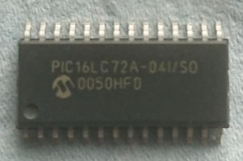
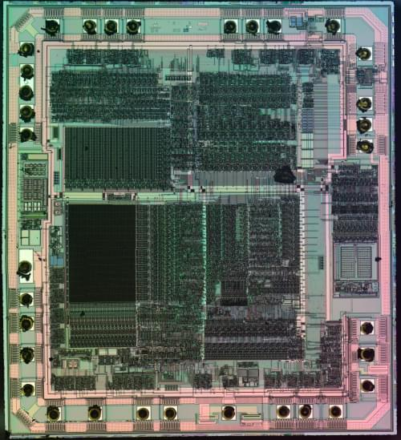

+++
title = "Decapped random chip - Microchip PIC16LC72A"
date = 2020-08-12
+++

This time I've decapped a [Microchip PIC16LC72A](https://www.microchip.com/wwwproducts/en/PIC16C72A), an 8-bit PIC microcontroller chip.

  

The chip is in SOIC-28 package and is the LC variant which supports lower VDD
voltage than the normal C variant. Based on the package marking information
described in the datasheet, the chip is from year 2000 week 50.

Here's the raw die after decapping (click for max resolution photo. *Warning: it's 16MB*):

  

*This photo was captured using my "Frankenscope", and is licensed under Creative
Commons Attribution 4.0 International.*

This die has 33 bonding pads with wires but the package has only 28 pins.  The
datasheet specifies that some pins change their input buffer type (e.g. Schmitt
Trigger / CMOS / TTL) depending on the currently selected function. Perhaps in
these cases the external pin connects to two separate pads with different input
buffer structures.
