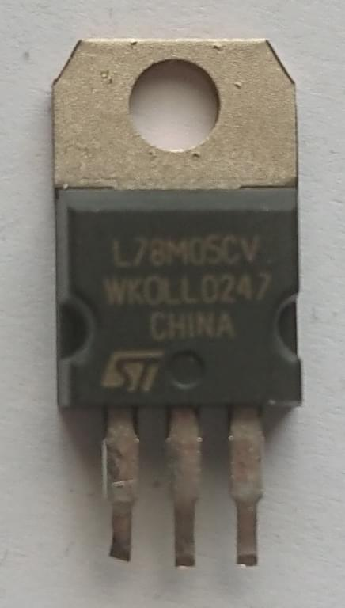

+++
title = "Decapped random chip - STMicro L78M05CV"
date = 2020-08-12
+++

This time I've decapped an [STMicro
L78M05CV](https://www.st.com/en/power-management/l78m.html), a fixed 5.0V
linear regulator chip. *Disclaimer: there's a small possibility I've mixed two
chips and the raw die photo is actually L7805CV instead...*

  

This version of the chip is in the TO-220 package, which requires more heat
than usual during thermal decapping, or the raw die might not detach cleanly
from the packaging. I actually decapped this one after a failed attempt with an
L7805CV chip in a similar package...

Here's the raw die after decapping (click for max resolution photo):

  

*This photo was captured using my "Frankenscope", and is licensed under Creative
Commons Attribution 4.0 International.*
