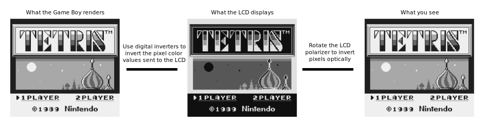
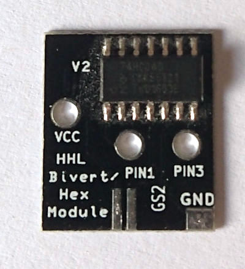
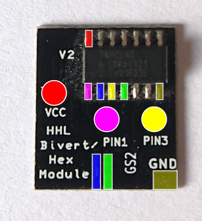
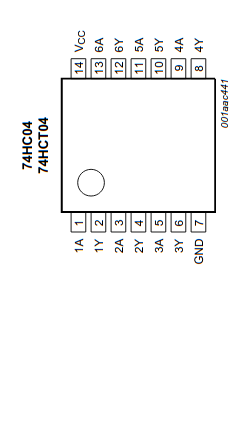
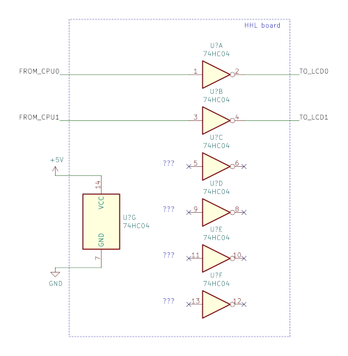
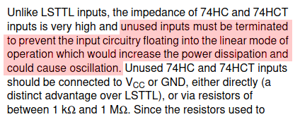
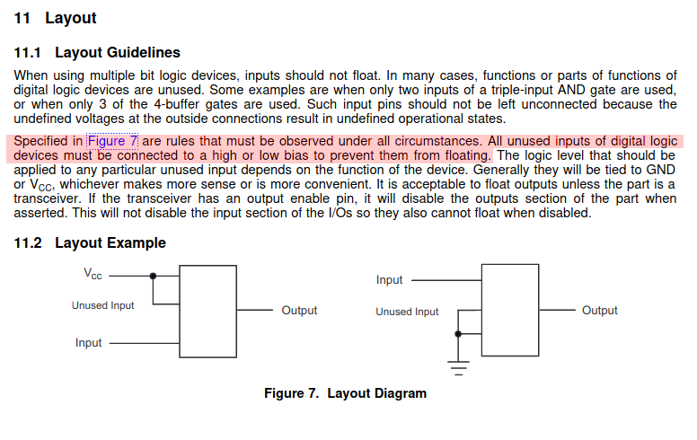
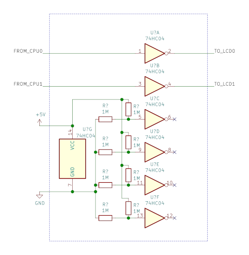
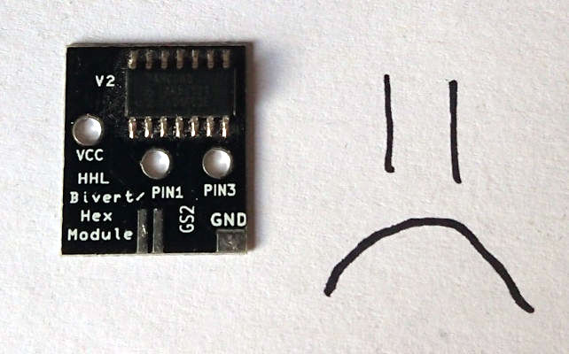

+++
title = "HHL Bivert Module V2 - technical review"
date = 2020-08-22
+++

Biverting a greyscale Game Boy screen is a very popular mod, because it's widely
considered to increase the screen contrast. The principle of biverting is
fairly simple: we invert the LCD pixels once digitally, and then again
optically. As a result, the pixels have the originally intended colors just
like without biverting (black is black, light grey is light grey, etc...). This
mod might sound pointless at first, but since the second inversion is done
optically, the screen behaves slightly differently and contrast is improved.
For the first inversion, we need a circuit that inverts the digital values of
the pixels pushed to the screen, and to achieve the second inversion, we can
simply rotate the screen polarizer 90 degrees.

The popularity of this mod has given rise to several bivert boards (sometimes
incorrectly referred to as "chips"). In this review I'll take a look at Bivert
Module V2 by Hand-Held Legend and see how good it is from a technical point of
view. Even a bare chip and several wires can do the job, but there are slight
differences in the results depending on how well the circuit is designed and
what components have been chosen. A simple well-designed board can make
biverting much easier than using a bare chip.

## HHL store page (captured on 2020-04-25)

First, here's a captured screenshot of the [HHL store
page](https://handheldlegend.com/products/game-boy-bivert-biversion-module).

And this is the description of the module:

> Bivert modules are an effective way to upgrade the appearance of your LCD
> display. This easy to install module increases contrast by biverting
> (inverting) the orientation of the pixels of your screen. Once installed,
> pixels will have a blue appearance and enhanced gray scale saturation. The
> board lies flat on the PCB and lines up with the exact solder points you need
> to use!
>
> * 0.6mm board - super thin!
> * 2mm added to the bottom of the board for easy soldering (V1 -> V2)
> * Compatible with the Game Boy Original (DMG) and the Game Boy Pocket (MGB)
>   (Extra wires needed)
> * Only 1 wire required for install in the DMG | 1 Wire is included!
> * Hex inverter is already soldered for you
> * Grounding for the remaining pins for increased reliability

### Store page analysis

Based on the photo, we can see that the board has only one component: an
Nexperia 74HC04D chip. This chip is a *hex inverter*: basically 6 digital
inverter circuits in one package (hex = 6, see
<https://en.wikipedia.org/wiki/6#Hexa>).  Each inverter circuit has one digital
input and one digital output, and the chip also has one power pin and one
ground pin which are shared by all the six inverters in the same package. A
perfectly fine chip for the job, although we'll see later in this review why
there are better alternatives.

The description on the store page is mostly fine, although it sounds slightly
inaccurate from a technical point of view. What does "biverting the orientation
of the pixels" mean? Orientation usually refers to relative position or
direction, which is something this board doesn't change. The text also seems to
suggest biverting is the same as inverting, which it's not.

Another slightly problematic part of the description is "grounding for the
remaining pins for increased reliability". What are the remaining pins, and how
is reliability increased by grounding them? We'll see later in this review what
this means and more importantly, what it doesn't mean.

## Board analysis

  

I bought one of these boards back in 2016 when I was doing backlight mods to
some Game Boys. This 2016 module looks exactly like the one in the store photo,
so presumably the design is still the same.

By using the continuity function of my multimeter, I checked all the
connections on the board, and ended up with the following photo with different
signals emphasized with different colours (next to the [chip
datasheet](https://assets.nexperia.com/documents/data-sheet/74HC_HCT04.pdf)
pinout for reference):

  

  

As you can see, the board is very simple. We have three round holes for VCC and
the inputs, one pad for GND, and two pads on the bottom edge for the outputs.
Every connection is between just two points, so this is pretty much a minimal
design needed for the use case. In the chip pinout, "A" signals are the inputs,
and "Y" signals are the outputs. VCC is the main power supply (+5V in this
case), and GND is the ground connection. Note also how more than half of the
chip pins have no connections (3A, 3Y, 4A, 4Y, 5A, 5Y, 6A, 6Y): they are just
soldered to pads which are not connected electrically to anything.

If this board was designed by me, I would've added a bypass capacitor next to
the chip for power supply smoothing since it adds only a tiny cost to the
board. Luckily the board is mounted very close to a ceramic bypass capacitor on
the Game Boy mainboard, so having no bypass capacitor here is not the end of
the world.

  

## The main design fault (a.k.a "how hard can it be to invert two digital signals?")

At first, the circuit design might seem perfectly reasonable, because it does
what it is supposed to do: it inverts two digital signals. However, some
problems arise from the choice of using a *hex inverter chip* (6 digital
inverters) when only two inverters are required to do the job. This means 4 out
of 6 inverter circuits on the chip are unused, and we have a total of 4 unused
inputs and 4 unused outputs. The problem with unused pins is that you can't
assume they can just be left unconnected. Especially *floating inputs*
(basically inputs that are not connected to a stable voltage level of some
sort) can lead to seemingly random problems.

Integrated circuits (IC) chips come in many technologies and families, but
today almost everything uses CMOS technology. In general, **CMOS inputs should
not float**, so unless some extra circuitry is providing a valid voltage level
to an input, it should not be left unconnected. Some people mistakenly think
that an unconnected pin is at 0V voltage level and it would be the same as
connecting the pin to ground, but this is not true.

### "Grounding for the remaining pins for increased reliability"

Let's go back to this statement on the store page... Grounding means creating
an electrical connection between something and a common ground point. A circuit
might actually have multiple grounds, but in this case there is only one common
ground, conveniently labeled as "GND" on the board. So, when they say
"remaining pins are grounded", I immediately assume those pins have a
connection to GND. However, the previously conducted continuity test with a
multimeter confirmed that the unused pins are not connected electrically to
anything on this board.

So, when they say "grounding for the remaining pins", they just mean those pins
are soldered to pads on the board and not left completely unsoldered. Compared
to using a bare chip and wires, having all pins soldered to a board does
decrease the risk of them touching something accidentally, which kinda
*"increases reliability"*. But this is **not the same as grounding them**. Note
that connecting all unused pins of a chip to GND is not what you should do
either, because unused *outputs* are better left unconnected!

### Handling unused pins

What should we do with unused pins then? The [chip
datasheet](https://assets.nexperia.com/documents/data-sheet/74HC_HCT04.pdf)
doesn't have any info about handling unused pins, but Nexperia has a convenient
[74HC/HCT/HCU family user
guide](https://assets.nexperia.com/documents/user-manual/HCT_USER_GUIDE.pdf),
which has the information we're looking for:

  

So, Nexperia's own documentation says **floating inputs are bad**, and since
we're dealing with a 74HC family chip, we can just connect unused inputs
directly to either VCC or GND to properly terminate them.

74HC04 is a very common chip manufactured by many companies, so what about some
other manufacturers? Texas Instruments has some information directly in the
[SN74HC04 datasheet](https://www.ti.com/lit/ds/symlink/sn74hc04.pdf):

  

  

TI also says **floating inputs are bad**, and specifically mention multi-input
chips with only some part of the chip used.

## Real-world measurements

We know that floating inputs are bad from a theoretical point of view, but
surely it can't be that bad since so many people have installed the HHL V2
bivert boards without problems...?

The good news is that in many cases you just get more power consumption and
possibly a bit more noise in the system. The bad news is that the overall
results are a bit random since they depend on the environment. The floating
inputs are basically like antennas and will pick up noise that then gets
inverted. As long as the Game Boy doesn't burst into flames, people don't
necessarily even notice the problems caused by this bivert module. But in the
absolute worst case, I can imagine something getting fried due to excessive
power consumption.

To conduct some real-world tests, I soldered wires to a backlit Game Boy that
has an inverted polarizer, so it just needs some kind of digital inverter to
complete the bivert solution. This setup allowed me to change the inverter
chip/board easily. I also soldered wires to the HHL board so it could be
plugged to a breadboard. In all tests, the VCC line was not connected directly
to the chip/board but via a multimeter in series so current measurement was
possible.

  

### Testing the HHL board

In this first test I simply connected the HHL board to the Game Boy using a
breadboard. Note: this setup performs slightly worse than a real bivert module
installation, because there's fairly long wires that can pick up noise and
there's also no decoupling capacitor nearby.

When turning on the Game Boy without any cartridge inserted, we can see a
wildly changing input current between 1-5 mA.

<video controls>
  <source src="test_HHL.mp4">
</video>

### Testing a bare chip

When I bought the bivert board from HHL in 2016, I also purchased a bare
74HC0D chip for testing. In this second test, I decided to solder this chip on
a breakout board so I could easily test different connections. I connected the
breakout board to the Game Boy exactly like the HHL board, but this setup is
even worse due to the fairly long breadboard connections that go to the
floating inputs. In other words, the antennas are longer.

When turning on the Game Boy without any cartridge inserted, we can see massive
input current around ~20-30 mA! That is a significant current wasted when we're
supposed to just invert two digital signals.

<video controls>
  <source src="test_chip1.mp4">
</video>

### Testing a bare chip connected correctly

In the previous test we saw that a bare chip could easily consume 30 mA when
floating inputs are not terminated correctly, but what about when everything
*is* connected correctly? In this test I connected all unused inputs to GND,
which is one of the correct ways to handle them, as mentioned by the TI
datasheet in the earlier section. The outputs are not connected to anything,
because they don't have to be! Since the inputs are connected to a stable
digital 0, the outputs will simply output a stable digital 1.

  

When turning on the Game Boy without any cartridge inserted, we can see a tiny
input current around ~0.8 µA. Note in the following video how I need to change
change the scale to µA to even see a non-zero value, and how the current is
stable instead of oscillating like crazy! The exact power consumption depends
on how much switching the inverters need to do, but overall this is a *huge*
difference.

<video controls>
  <source src="test_chip2.mp4">
</video>

### Testing the "forbidden zone"

Floating inputs cause extra power consumption due to two main reasons.
Firstly, power is consumed when switching happens. With unused inputs we're
basically inverting random noise, which can change rapidly causing power to be
wasted on switching the unused outputs. Secondly, standard CMOS chip inputs
have a "forbidden zone" between low and high states, where a lot of power is
consumed. During switching, the voltage passes through this forbidden zone, so
for a very short time power consumption goes high. Normally this state only
happens during the quick transition, and most of the time the voltage is either
in the valid low or valid high state. However, if random noise in the
environment happens to cause unused inputs to settle in this forbidden zone for
long periods of time, this can add massive power consumption and even cause
damage.

I wanted to further test the worst possible case, so I used 1M resistors to
create voltage dividers for all the unused inputs so that the unused inputs
would see around 2.5V, which happens to be in the forbidden zone.

  

After turning on the Game Boy without any cartridge inserted, we can see input
current go as high as 52 mA in this test!

<video controls>
  <source src="test_chip3.mp4">
</video>

### Measurement result summary

Based on this set of quick tests, the HHL board wastes unnecessary power due to
the main design flaw, although the wasted power wasn't even close to the worst
case scenario. However, this greatly depends on the environment and the noise
picked up by the floating inputs. In some previous tests I've done with the HHL
board, I've seen higher numbers and the input current has been affected by nearby
electronical devices and even random pieces of unconnected wires!

| Test                     | Input current |
| ------------------------ | ------------- |
| HHL board                | 1-5 mA        |
| Correctly used bare chip | 0.000008 mA   |
| HHL-style bare chip      | 20-30 mA      |
| Worst case bare chip     | 52 mA         |

## Verdict

**Not terrible, but definitely not recommended**

HHL Bivert Module V2 is not a bad product, but I can't recommend it due to the
fundamental problems in the circuit design. It's probably better than using a
bare chip, but an even better choice would be to use a properly designed
alternative. If you already have a HHL board, you can fix the main flaw with 4
extra wires by connecting the unused inputs to either GND or +5V, but in my
opinion this defeats the point of using this board.

### Better alternatives

A better alternative is a board that uses a dual inverter and preferably also
includes a bypass capacitor. When a dual inverter is used, there are no unused
circuits so there's no need to handle them in any way!

*Disclaimer: The following alternatives look good from a circuit design point
of view. I haven't actually tested them, and have no idea if they are good
based on different criteria (e.g. ease of installation, price)*

#### HHL Game Boy Pocket Bivert module

<https://handheldlegend.com/collections/game-boy-pocket-mgb/products/game-boy-pocket-bivert-module-mini>

HHL's own bivert module for *Game Boy Pocket* is fine since it uses a dual
inverter.

#### J.Rodrigo's DMG and MGB bivert boards

<https://www.tindie.com/products/jrodrigo/bivert-module-for-nintendo-game-boy-dmg/>

<https://www.tindie.com/products/jrodrigo/bivert-module-for-nintendo-game-boy-pocket/>

These are good dual inverter designs.

#### Thursday Customs Hex Inverter

<https://store.thursdaycustoms.com/product/hex-dmg>

This seems like a good dual inverter design, although the product description
is *very misleading*.

Like several other alternatives, it uses a dual inverter, so calling it "hex
inverter" is complete nonsense. Even the installation instructions say "Your
MGB is now hex inverted", which makes no sense. If somebody installed a
single-core CPU to their PC and called it "quad-coring the PC", they would
probably be laughed at...

## TL;DR

* A poorly designed bivert solution can consume more than 50 000 times the
  power compared to a properly designed one
* In a random test this HHL board consumed "just" ~1000 times the power
  compared to a proper design, which would add zero extra cost to the board
* Is this a good bivert board? No
* Will it destroy my Game Boy? *Probably* not
* Will it unnecessarily waste power and generate heat? Yes
* Will it increase audible noise in the system? Maybe
