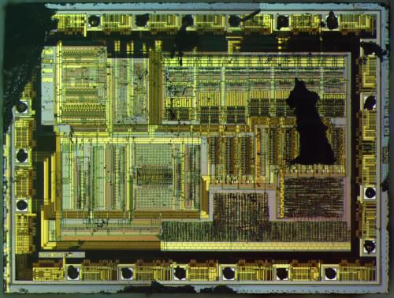

+++
title = "Random chip decap - Samsung S4L85K1X01"
date = 2020-08-04
+++

I've decided to start decapping random chips I've harvested from various boards
to practice both the decapping procedure and imaging/stitching of microscope
photos. Today's specimen is a Samsung S4L8K1X01 chip, which I think came from a
mobile phone (Samsung S3 mini perhaps??). There's no public data sheet
available, but based on some searches it seems to be some kind of memory chip.

  

The chip is in a 20-pin SSOP-like package with leads on two sides. Here's the
raw die after decapping (click for max resolution photo):

  

*This photo was captured using my "Frankenscope", and is licensed under Creative
Commons Attribution 4.0 International.*

The bonding pads are laid out on four sides, which is different than the layout
of the leads on the package. Luckily some of the bonding pads have helpful
numbers on them, so we can easily tell pin 1 is on the left, and the rest are
laid out in a counter-clockwise order.

So, is it a memory chip? I really can't tell 😊 With higher magnification and
less damaged sample it would be possible to do deeper reverse engineering, but
I'll save my time for more interesting chips.
