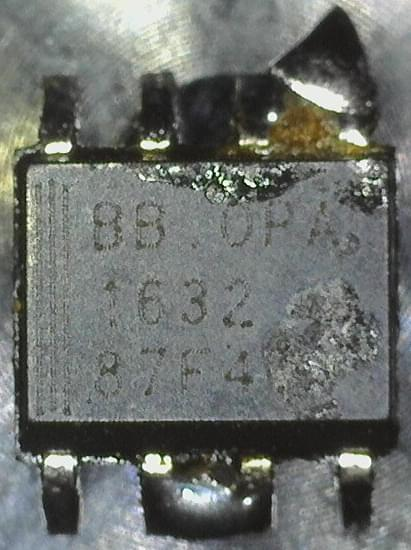
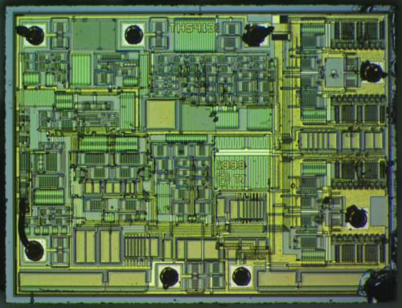

+++
title = "Random chip decap - Texas Instruments OPA1632"
date = 2020-08-04
+++

This time I've decapped a [Texas Instruments
OPA1632](https://www.ti.com/product/OPA1632), a fully-differential operational
amplifier chip.

  

This specimen is an OPA1632D, which is the SOIC-8 -packaged version of the
chip. Here's the raw die after decapping (click for max resolution photo):

  

*This photo was captured using my "Frankenscope", and is licensed under Creative
Commons Attribution 4.0 International.*

There's one very interesting detail here: the label says THS4131, [which is a
different product](https://www.ti.com/product/THS4131) and much more expensive!
What's going on?

Some people on the Internet have already noticed that OPA1632 and THS4131 have
almost identical characteristics based on their datasheets. Both most likely
use the same chip design, but the dies are tested after manufacture and labeled
either as OPA1632 or THS4131 depending on their characteristics. Apparently
THS4131 has slightly better specs, so the slightly worse performing chips are
probably sold as OPA1632.

There's nothing surprising or new about this, since many manufacturers sell
lower-performing parts as different models. It makes perfect sense, since the
chips are still functional but simply don't satisfy the full specs of the more
expensive chips.
