+++
title = "8 years of Game Boy tweets"
date = 2022-12-26
+++

Thanks to the "great" effort of Elon Musk, Twitter is in flames and I've suddenly realized all my data there is potentially at risk. During the last 8 years, I've occasionally tweeted about my Game Boy research and projects, so here's an archive of my Game Boy tweets with some extra commentary.

Quick links to each year:

- [2015: Research begins](#2015)
- [2016: First custom hardware to support research](#2016)
- [2017: Hardware tests using GB-BENCH-G1, more discoveries, birth of gb-ctr](#2017)
- [2018: Reverse engineering expanded to decap photo tracing, more custom hardware work](#2018)
- [2019: Discovery that GB uses "SM83 CPU core", being busy with too many GB projects](#2019)
- [2020: SM83 CPU decap photo tracing, various GB schematics, work on better decapping microscope](#2020)
- [2021: SM83 CPU work burnout, focus on better microscope and random GB projects](#2021)
- [2022: More schematics, SM83 CPU core fully reverse engineered](#2022)

## 2015: Research begins {#2015}

### 2015-01-13

> Mooneye GB: A Gameboy emulator written in Rust [link](@/blog/2015/mooneye-gb-a-gameboy-emulator-written-in-rust.md)

This tweet is the one that started it all: In late 2014 I had started my emulator assuming there was plenty of accurate documentation about the Game Boy. After all, it was a 25 year old game console, so why wouldn't we fully understand it at that point? I quickly realized how wrong I was, and started to research the hardware myself without much knowledge about digital electronics. After a couple of months, the first public commit of Mooneye GB appeared on Github.

Looks like I also didn't know the correct spelling/capitalization of Game Boy at this time. 😅

### 2015-02-14

> Mooneye GB: Gameboy cartridge types [link](@/blog/2015/mooneye-gb-gameboy-cartridge-types.md)

### 2015-05-01

> Mooneye GB: Cartridge analysis - Tetris (no MBC) [link](@/blog/2015/mooneye-gb-cartridge-analysis-tetris.md)

### 2015-05-17

> Mooneye GB: Cartridge analysis - Wizards & Warriors X: Fortress of Fear (MBC1) [link](@/blog/2015/mooneye-gb-cartridge-analysis-fortress-of-fear.md)

### 2015-05-18

> Mooneye GB: Cartridge analysis - three games with DMG-BEAN-02 boards [link](@/blog/2015/mooneye-gb-cartridge-analysis-dmg-bean-02.md)

### 2015-09-13

> Dumping the Super Game Boy 2 boot ROM [link](@/blog/2015/dumping-the-super-game-boy-2-boot-rom.md) 
> [Attached photo](643077561082347520-COyrojhUYAA-Xmq.jpg)

This boot ROM dump was pretty exciting for me, because it proved I could perform the dump with fairly primitive tools...at this point I didn't know dumping would be even easier on non-SGB devices using a simpler method.

### 2015-09-27

> Mooneye GB 0.1.0 released [link](@/blog/2015/mooneye-gb-0-1-0-released.md)

Initial (and at the time of writing, the only) release of Mooneye GB 😅 . I was of course planning to release more versions, but at this point I didn't realize research would take all my time and my focus would shift away from actual emulator development.

## 2016: First custom hardware to support research {#2016}

### 2016-03-19

> Game Boy cartridge PCB photos [link](@/blog/2016/game-boy-cartridge-pcb-photos.md)

### 2016-08-05

> My rapid Game Boy development cartridge works! &lt;1 s save-compile-flash-reboot-observe cycle on real hardware 
> [Attached photo 1](761667041317314560-CpH71AOWIAAIvqG.jpg) 
> [Attached photo 2](761667041317314560-CpH71AQWAAA7TFj.jpg)

GB-LIVE32 v1.0 was very exciting for me! The initial design had some issues but the approach of using a small static RAM chip as the "cartridge ROM" worked, and it made it very quick to update the "ROM" contents leading to quick feedback from real hardware.

### 2016-08-06

> Here's a (low-quality gif) video of the rapid development cart <https://gfycat.com/EquatorialCavernousFish> No touching of cables or power switches

### 2016-10-11

> Game Boy test ROM do's and don'ts [link](@/blog/2016/game-boy-test-rom-dos-and-donts.md)

### 2016-10-17

> Finally found a Game Boy with the elusive DMG-CPU C. Just one more CGB CPU version and I have all the GB CPUs for research and testing

*Narrator's voice*: Unfortunately he didn't realize he'd discover even more GB CPU versions later...

### 2016-10-19

> Got the CPU CGB A as well, so I now have a full set of 18 Game Boy CPUs (I don't care about OXY so CPU AGB E is not included)

### 2016-12-06

[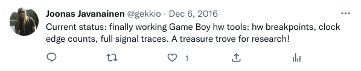](https://twitter.com/gekkio/status/806218871749414912)

> Current status: finally working Game Boy hw tools: hw breakpoints, clock edge counts, full signal traces. A treasure trove for research!

This was another research breakthrough...GB-BENCH made it possible to gather full signal traces of almost all the SoC chip pins, and do much lower level hardware testing than what was previously possible.

### 2016-12-08

[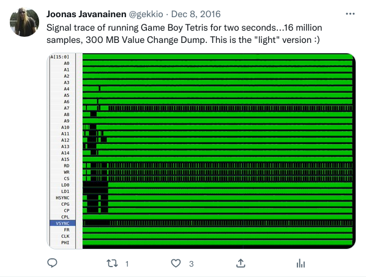](https://twitter.com/gekkio/status/806980625374806016)

> Signal trace of running Game Boy Tetris for two seconds...16 million samples, 300 MB Value Change Dump. This is the "light" version :) 
> [Attached screenshot](806980625374806016-CzL3r5GWEAAvpxS.jpg)

### 2016-12-09

> Let's zoom in until we can see the single byte read from $0040 when the CPU reads the first instruction of the vblank routine 
> [Attached video](806989678041825280-CzMAhU_WEAELTc5.mp4)

## 2017: Hardware tests using GB-BENCH, more discoveries, birth of gb-ctr {#2017}

### 2017-06-10

[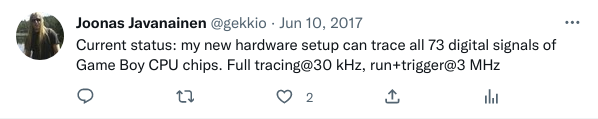](https://twitter.com/gekkio/status/873554988945076226)

> Current status: my new hardware setup can trace all 73 digital signals of Game Boy CPU chips. Full tracing@30 kHz, run+trigger@3 MHz

### 2017-06-18

> Brace yourselves...more GB test ROMs are coming. VRAM/OAM accessibility timing for read and write can differ! And it makes sense from hw POV

> Like taking candy from a baby 
> [Attached screenshot](876479425717698561-DCnhDR-WsAARHSj.jpg)

In retrospect I was sometimes a bit too proud of finding problems with existing emulators...at some point I realized this and stopped announcing these kind of things and instead just released test ROMs, or preferably released documentation first and tests later.

### 2017-06-30

> HW is blocking my research progress ATM...Who knew a system with ~200 loose wires and 5 boards could have noise issues? :P ;) Time for KiCad

### 2017-07-06

> Hmm...using a slow slew rate for the GB clock has fixed my HW issues. I hate magic like this but I'll use this as long as things work :P

### 2017-07-12

> Joined the Rigol DS1000Z owner club. Here's the clock signal from my CPLD to the Game Boy CPU (divided to 1MHz because of noise issues) 
> [Attached picture](884881227261640704-DEe06diXgAEjphy.jpg)

### 2017-07-19

> Time to start doing preliminary routing of this monster 
> [Attached screenshot](887777372124196868-DFIEhHdXcAEpcLJ.jpg)

This monster would turn out to be GB-BENCH-G1, the first fully integrated GB-BENCH where everything was on a single board. The previous version (not released as open source) consisted of multiple PCBs and a lot of wiring was required. It worked, but was quite unreliable at times.

### 2017-08-21

[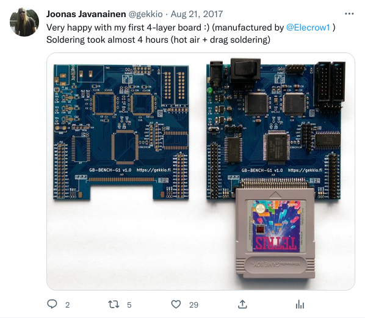](https://twitter.com/gekkio/status/899567037923696640)

> Very happy with my first 4-layer board :) (manufactured by Elecrow) Soldering took almost 4 hours (hot air + drag soldering) 
> [Attached photo](899567037923696640-DHvkubLXoAE5y4c.jpg)

### 2017-08-28

> Added Lisp scripting to my GB testbench :) I don't even like lisps but it works quite nicely here. Dialect is Ketos: <https://github.com/murarth/ketos>

### 2017-09-03

> Published sources for my GB breakout board v3.0. This version was designed with KiCad <https://github.com/Gekkio/gb-hardware> 
> [Attached photo](904428788565594112-DI0s9klXUAQxNww.jpg)

### 2017-09-10

> Problem? My problem is that I still don't have all the Game Boys I need ;) 
> [Attached photo](906930836804702208-DJYQLVZXcAAIqUk.jpg)

### 2017-09-19

[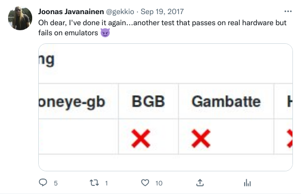](https://twitter.com/gekkio/status/910225035763306502)

> Oh dear, I've done it again...another test that passes on real hardware but fails on emulators 😈 
> [Attached screenshot](910225035763306502-DKHEWF7XUAg7IZ9.jpg)

### 2017-12-03

> New GB hardware test: ei_sequence <https://github.com/Gekkio/mooneye-gb/commit/b61f9c6e8b3d809957846cd932760aa0398e0a3b>

> Another new GB hardware test: mbc1/bits_ram_en <https://github.com/Gekkio/mooneye-gb/commit/7e34ea3bde5b1192ee2d6d51b2704764785d60dc>

### 2017-12-04

> It's been on Github for quite some time already, but I think it's time to start actively telling people about the existence of my WIP reference documentation of all GB things: <https://github.com/Gekkio/gb-ctr>

[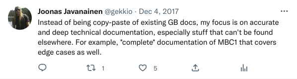](https://twitter.com/gekkio/status/937654134613962752)

> Instead of being copy-paste of existing GB docs, my focus is on accurate and deep technical documentation, especially stuff that can't be found elsewhere. For example, *complete* documentation of MBC1 that covers edge cases as well.

At this point I was naively hoping more people would read gb-ctr...lack of readers and lack of feedback are the main reasons why I ended up updating gb-ctr rarely.

### 2017-12-05

[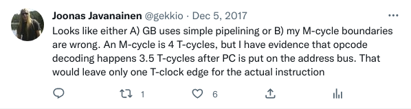](https://twitter.com/gekkio/status/938103486113304576)

> Looks like either A) GB uses simple pipelining or B) my M-cycle boundaries are wrong. An M-cycle is 4 T-cycles, but I have evidence that opcode decoding happens 3.5 T-cycles after PC is put on the address bus. That would leave only one T-clock edge for the actual instruction

*Narrator's voice*: Option A would later turn out to be true!

### 2017-12-06

[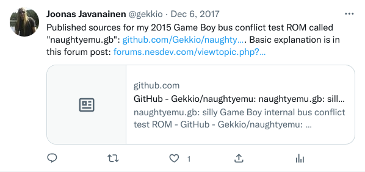](https://twitter.com/gekkio/status/938412089554718720)

> Published sources for my 2015 Game Boy bus conflict test ROM called "naughtyemu.gb": <https://github.com/Gekkio/naughtyemu>. Basic explanation is in this forum post: <https://forums.nesdev.org/viewtopic.php?f=20&t=16796&p=209596#p209596>

### 2017-12-11

[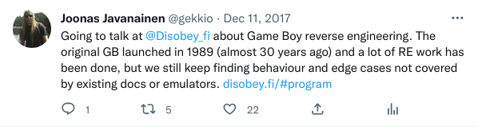](https://twitter.com/gekkio/status/940235979117547521)

> Going to talk at @Disobey_fi about Game Boy reverse engineering. The original GB launched in 1989 (almost 30 years ago) and a lot of RE work has been done, but we still keep finding behaviour and edge cases not covered by existing docs or emulators. [disobey.fi/#program](https://disobey.fi)

This was going to be a big public talk in front of a fairly large audience...very intimidating to an introvert like me, but I couldn't pass the opportunity, even as an inexperienced public speaker!

## 2018: Reverse engineering expanded to decap photo tracing, more custom hardware work {#2018}

### 2018-01-05

> Finished tracing all the signal pins in this DMG-CPU B decap photo.
> Yes, there will eventually be an interactive viewer with toggling/coloring of signals ;)
>
> (Decap photo CC BY 4.0 digshadow / <https://siliconpr0n.org>) 
> [Attached picture 1](949236843933036544-DSxdKR0WAAAFix5.jpg) 
> [Attached picture 2](949236843933036544-DSxdLAUWsAUBcxf.jpg) 
> [Attached picture 3](949236843933036544-DSxdMEYW4AAfjNt.jpg)

*Narrator's voice*: Sadly an interactive viewer was never created...

> Here's a version of the earlier picture with pin labels added 
> [Attached picture](949372419327881219-DSzYoeoX0AAAhGP.jpg)

### 2018-01-08

[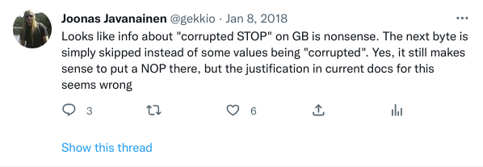](https://twitter.com/gekkio/status/950444423242043393)

> Looks like info about "corrupted STOP" on GB is nonsense. The next byte is simply skipped instead of some values being "corrupted". Yes, it still makes sense to put a NOP there, but the justification in current docs for this seems wrong

> "A wild STOPHALT bug appeared!"...so it turns out that executing STOP *while already pressing a button* doesn't do STOP but a different version of HALT. And yes, the HALT bugs are also present here but in a weird way

### 2018-01-30

> Ugh... GB bench v1 has 3 separate power rails and it wasn't easy to design the board and route it. In v2 I've got 6 power rails so far in the design from just following datasheet recommendations :O challenge accepted :)

### 2018-02-04

> Here's my GB talk from Disobey :D the fine details section has some errors, but I'll write an errata blog post soon to point out the errors

[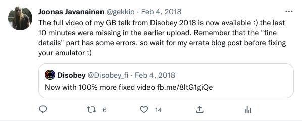](https://twitter.com/gekkio/status/960235856849227777)

> The full video of my GB talk from Disobey 2018 is now available :) the last 10 minutes were missing in the earlier upload. Remember that the "fine details" part has some errors, so wait for my errata blog post before fixing your emulator ;) https://twitter.com/Disobey_fi/status/960221371619045377

Despite being nervous at first, the talk went well and I'm very happy about the whole thing!

### 2018-02-06

> Errata blog post for my GB talk is now available. The last section (="fine details") had some wrong clock edges, although the main points are still valid and remain the same [link](@/blog/2018/errata-for-reverse-engineering-fine-details-of-game-boy-hardware.md)

### 2018-02-27

> THE TIME FOR HIDE AND SEEK IS OVER, MR CHIP. I FOUND YOU!
>
> Soooo, once again I can say that I've got all the known GB CPU versions :) 
> [Attached photo](968543728100093952-DXD0yyTX4AMJ3J-.jpg)

### 2018-03-15

> Discovered a new hw technique yesterday: I can now read/write GB hw registers freely in my test bench, so I can read stuff like PPU registers at *one clock edge accuracy*. This is *huge*!!
>
> Screenshot 1: scanline LY + modes 
> Screenshot 2: mode 1 / line 144 
> [Attached screenshot 1](974183960845672449-DYT9f6VXUAAK5Lm.jpg) 
> [Attached screenshot 2](974183960845672449-DYT9obaXcAAxmbh.jpg)

### 2018-03-18

> New GB test ROM: acceptance/ppu/stat_lyc_onoff
>
> You know the drill...it passes on all real hardware versions and fails in every emulator I tested (including mine) :) 
> [Attached screenshot](975409992688861184-DYlS9QGW4AA2qLQ.jpg)

### 2018-03-24

[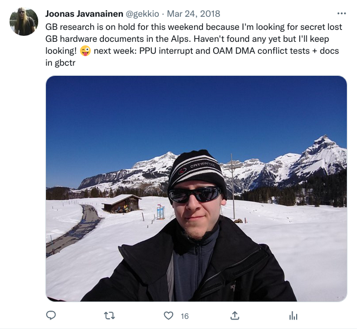](https://twitter.com/gekkio/status/977530749934063621)

> GB research is on hold for this weekend because I'm looking for secret lost GB hardware documents in the Alps. Haven't found any yet but I'll keep looking! 😜 next week: PPU interrupt and OAM DMA conflict tests + docs in gbctr 
> [Attached photo](977530749934063621-DZDjA73WkAAQyMp.jpg)

### 2018-03-27

[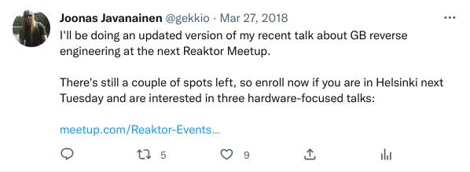](https://twitter.com/gekkio/status/978585482786492417)

> I'll be doing an updated version of my recent talk about GB reverse engineering at the next Reaktor Meetup.
>
> There's still a couple of spots left, so enroll now if you are in Helsinki next Tuesday and are interested in three hardware-focused talks:
>
> <https://www.meetup.com/reaktor-events-helsinki/events/248991039>

### 2018-04-01

> Now I'm pretty sure the glop top DMG CPU is the B version.
>
> Left: DMG-CPU B (© Digshadow/siliconpr0n.org) 
> Right: glop top decap by me
>
> The die took a lot of damage, but the "L20A" part of "CESL20A" is IMHO clearly visible. 
> [Attached photo](980442995110678528-DZs6IUFXUAAKy3C.jpg)

This was an important discovery: the glop top chips were not inherently unique, but were simply repackaged B and C revisions. The revision is even indicated on the board, which is obvious in hindsight 😄

### 2018-04-26

> I'll be speaking about Game Boy reverse engineering at @ReaktorBP on May 24th. My talk includes live hw demos and some newly discovered hw details :D
>
> There's a lot of exciting talks at the event, so check out the program and get your tickets here: [reaktorbreakpoint.com](https://reaktorbreakpoint.com)

### 2018-05-03

> Finally received my shipment of 50 Game Boy link ports. Gonna use several for, uh, a project ;) Now I just need to create a couple of new KiCad symbols+footprints, design a PCB and write some VHDL...

*Narrator's voice*: Unfortunately these link ports would remain in storage, because he ended up focusing on too many other projects...

### 2018-05-05

> Another day, another board :) This is just an update to my old GB-LIVE32 board, but it's an important stepping stone to something bigger... 
> [Attached screenshot](992706504800264192-DcbMDJ0X4AEV8qI.jpg)

### 2018-05-11

[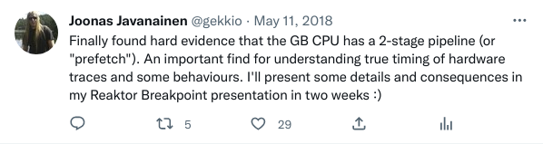](https://twitter.com/gekkio/status/994892528049643520)

> Finally found hard evidence that the GB CPU has a 2-stage pipeline (or "prefetch"). An important find for understanding true timing of hardware traces and some behaviours. I'll present some details and consequences in my Reaktor Breakpoint presentation in two weeks :)

### 2018-05-14

> It's going to require a lot of effort to have Game Boy Pocket and Game Boy Color CPU support in my test bench system, but this is how it starts: desoldering CPU chips for upcoming test bench boards. (also in picture: various support chips) 
> [Attached photo](996102947233828864-DdLdXBeW0AECQca.jpg)

### 2018-05-27

[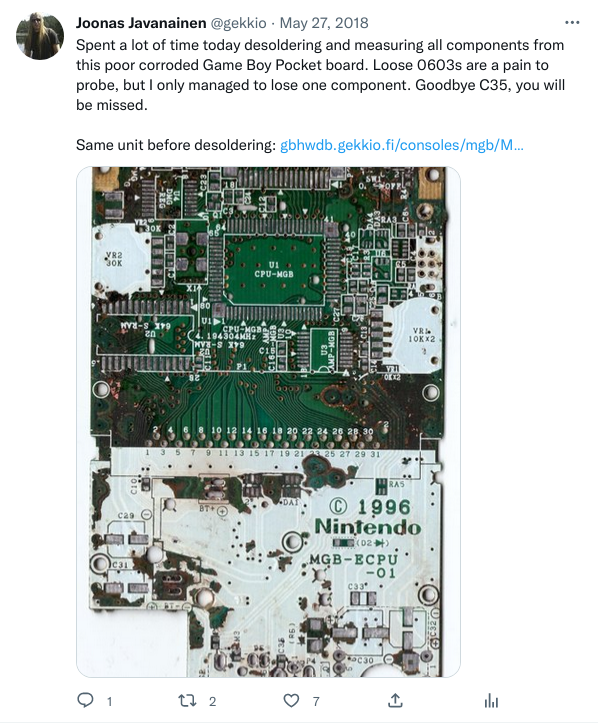](https://twitter.com/gekkio/status/1000836098371842049)

> Spent a lot of time today desoldering and measuring all components from this poor corroded Game Boy Pocket board. Loose 0603s are a pain to probe, but I only managed to lose one component. Goodbye C35, you will be missed.
>
> Same unit before desoldering: <https://gbhwdb.gekkio.fi/consoles/mgb/MH12129596.html> 
> [Attached photo](1000836098371842049-DeOtTuBX0AIK7fE.jpg)

### 2018-06-06

[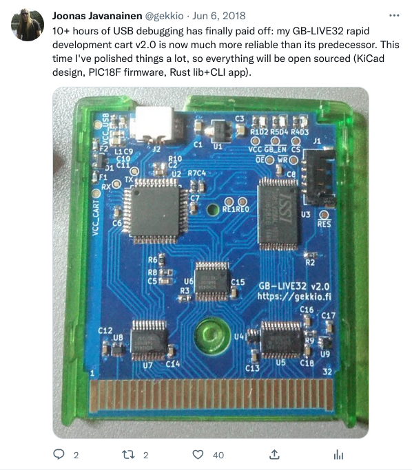](https://twitter.com/gekkio/status/1004453394508079104)

> 10+ hours of USB debugging has finally paid off: my GB-LIVE32 rapid development cart v2.0 is now much more reliable than its predecessor. This time I've polished things a lot, so everything will be open sourced (KiCad design, PIC18F firmware, Rust lib+CLI app). 
> [Attached photo](1004453394508079104-DfCH-9sX0AEVhnR.jpg)

GB-LIVE32 v2.0 would turn out to be a true workhorse for hardware testing! I even gave some to other people so they could run tests much easier and faster.

### 2018-07-08

> Getting ready to start routing this little guy...if this works out, it means I can create a working MAX 10 FPGA design with some high speed IO included. And that is the road to GB-BENCH v2 with new stuff like audio capture and Game Boy Color CPU support 
> [Attached photo](1015721966483988481-DhiEtMhWAAEUB0j.jpg)

This turned out to be too ambitious...in 2022 GB-BENCH v2 still hasn't been completed, and I've iterated various different designs without actually building anything.

### 2018-07-11

> Here's a (very) rough demo video of my GB-LIVE32 v2.0 rapid development cartridge:
>
> <https://www.youtube.com/watch?v=GCIcgmga9Mo>
>
> Now fully open source!
>
> KiCad/gerbers: <https://github.com/gekkio/gb-hardware> 
> Firmware/software: <https://github.com/gekkio/gb-live32>

### 2018-08-27

[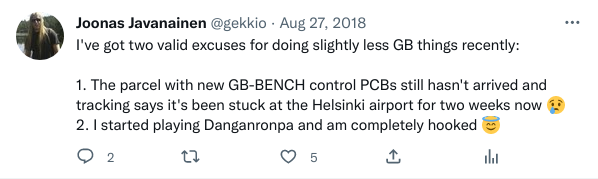](https://twitter.com/gekkio/status/1034157871372484608)

> I've got two valid excuses for doing slightly less GB things recently:
>
> 1. The parcel with new GB-BENCH control PCBs still hasn't arrived and tracking says it's been stuck at the Helsinki airport for two weeks now 😢 
> 2. I started playing Danganronpa and am completely hooked 😇

### 2018-09-11

[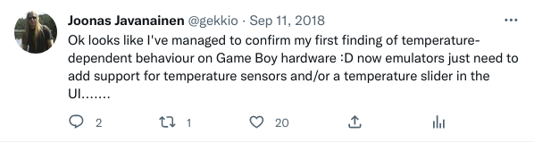](https://twitter.com/gekkio/status/1039588344706093057)

> Ok looks like I've managed to confirm my first finding of temperature-dependent behaviour on Game Boy hardware :D now emulators just need to add support for temperature sensors and/or a temperature slider in the UI.......

### 2018-11-04

> TIL:
> a Game Boy and 2 games in hand luggage is normal. 
> 3 Game Boys and 6 games in hand luggage gets you "Sir, you've got a lot of electronics in your bag" and a bag search at the airport security :D
>
> (not complaining...I'm sure it looks a bit unusual :P)

### 2018-11-13

> Current status: experimenting with different approaches to writing a parser that can identify chips on GB cartridge boards based on the chip labels 
> [Attached video](1062412348349136897-Dr5xmWsW4AExhpl.mp4)

Spoiler: regex won 😄. My GB hardware database site would eventually switch to regexes to parse chip information from labels.

## 2019: Discovery that GB uses "SM83 CPU core", being busy with too many GB projects {#2019}

### 2019-01-06

> I'm entirely convinced that the original GB CPU chip uses a Sharp SM83 CPU core. And there are public datasheets of some chips that use the same core....😍

This was a huge discovery and perhaps even a historical moment in GB research...I think I was searching some datasheet archive for Sharp, STOP, and HALT, and randomly stumbled upon some SM83xx SoC datasheet. After staring at it for a while, I realized the instruction set looked suspiciously familiar, and started to investigate more. Eventually I realized it was a perfect match for the GB CPU core.

### 2019-01-13

[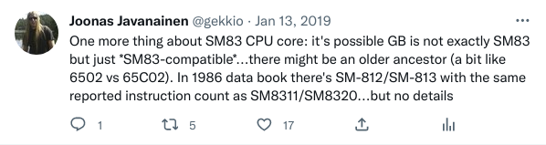](https://twitter.com/gekkio/status/1084391449087655936)

> One more thing about SM83 CPU core: it's possible GB is not exactly SM83 but just *SM83-compatible*...there might be an older ancestor (a bit like 6502 vs 65C02). In 1986 data book there's SM-812/SM-813 with the same reported instruction count as SM8311/SM8320...but no details

I can't emphasize this enough...SM83 is still the best guess, but personally I still suspect GB SoCs might have the unnamed predecessor.

### 2019-01-14

[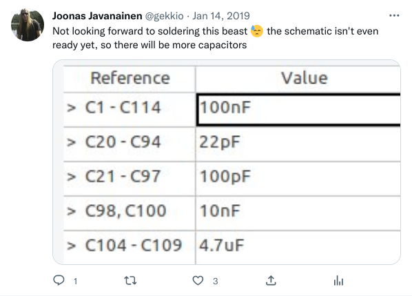](https://twitter.com/gekkio/status/1084572996868677632)

> Not looking forward to soldering this beast 😓 the schematic isn't even ready yet, so there will be more capacitors 
> [Attached screenshot](1084572996868677632-Dw0sZazXQAAePgm.jpg)

Yet another GB-BENCH v2 attempt that would turn out to be a waste of time...

### 2019-06-01

[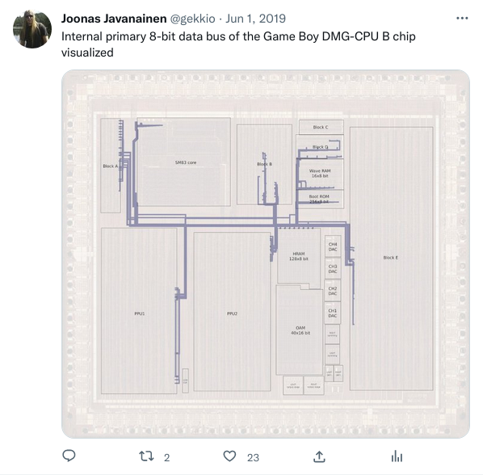](https://twitter.com/gekkio/status/1134568927210684416)

> Internal primary 8-bit data bus of the Game Boy DMG-CPU B chip visualized 
> [Attached screenshot](1134568927210684416-D77L5qqXYAIntX-.jpg)

### 2019-06-07

[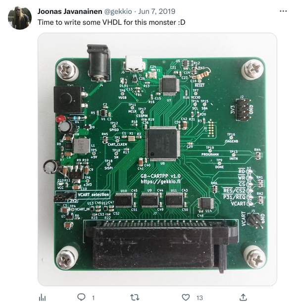](https://twitter.com/gekkio/status/1137068368983396353)

> Time to write some VHDL for this monster :D 
> [Attached photo](1137068368983396353-D8etpe6WkAEM0tH.jpg)

I still use GB-CARTPP Pro (known as just GB-CARTPP at the time), because it's crazy fast and reliable. I'm very happy about this little device, even though v1.0 had some design issues that needed some ugly bodges.

### 2019-06-19

> Experimenting with Ghidra and Game Boy ROM reverse engineering...there's no official support for GB but my custom language support files work already surprisingly well 
> [Attached screenshot](1141447103740284930-D9c69Y8WwAc3cYf.jpg)

This would become GhidraBoy a bit later, and would become my primary tool for GB ROM reverse engineering.

### 2019-06-23

[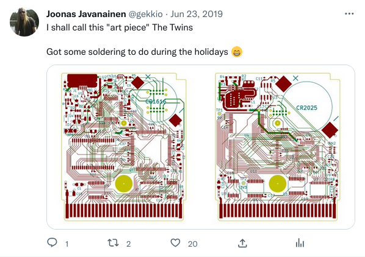](https://twitter.com/gekkio/status/1142792866814746624)

> I shall call this "art piece" The Twins
>
> Got some soldering to do during the holidays 😁 
> [Attached screenshot](1142792866814746624-D9wC8pDWsAYWyqh.jpg)

Sadly both twins didn't survive very long...I got the PCBs and soldered everything, but both designs had too many issues and I ended up scrapping them.

### 2019-07-15

> My FPGA-based GB cartridge dumper can now dump a Tetris cart ROM in ~40 ms. It's overkill, but I'm practicing using FT232H USB chip's FT245 sync mode (~40 MB/s half-duplex, but limited here to ~15 MB/s at the moment, because pipelining in my VHDL code isn't yet perfect)

### 2019-07-17

[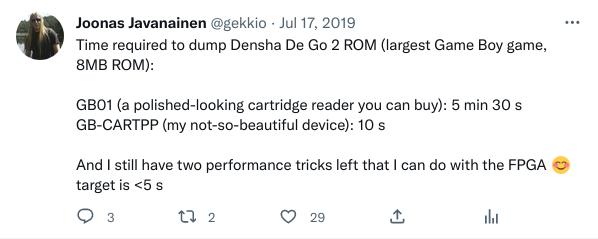](https://twitter.com/gekkio/status/1151475649359601664)

> Time required to dump Densha De Go 2 ROM (largest Game Boy game, 8MB ROM):
>
> GB01 (a polished-looking cartridge reader you can buy): 5 min 30 s 
> GB-CARTPP (my not-so-beautiful device): 10 s
>
> And I still have two performance tricks left that I can do with the FPGA 😊 target is <5 s

### 2019-07-18

[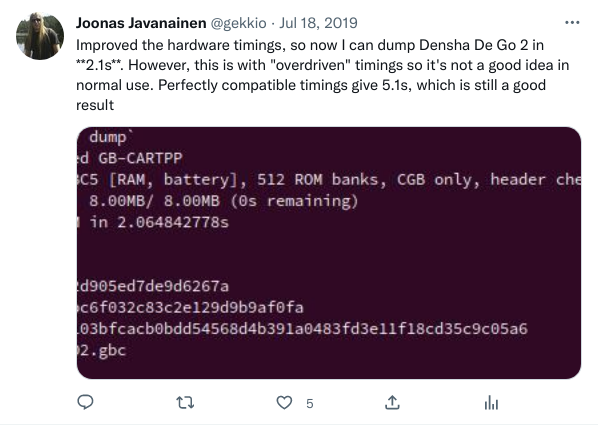](https://twitter.com/gekkio/status/1151883272496013314)

> Improved the hardware timings, so now I can dump Densha De Go 2 in **2.1s**. However, this is with "overdriven" timings so it's not a good idea in normal use. Perfectly compatible timings give 5.1s, which is still a good result 
> [Attached screenshot](1151883272496013314-D_xNxBHXsAAhKdN.jpg)

### 2019-07-26

[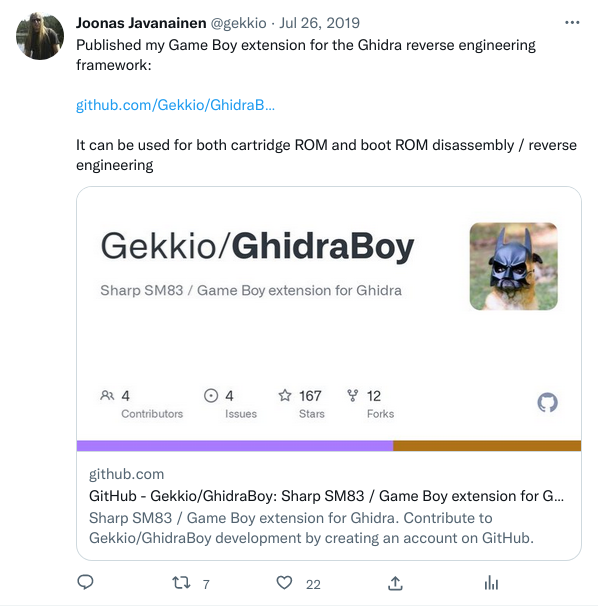](https://twitter.com/gekkio/status/1154832167836553216)

> Published my Game Boy extension for the Ghidra reverse engineering framework:
>
> <https://github.com/Gekkio/GhidraBoy>
>
> It can be used for both cartridge ROM and boot ROM disassembly / reverse engineering

### 2019-08-03

[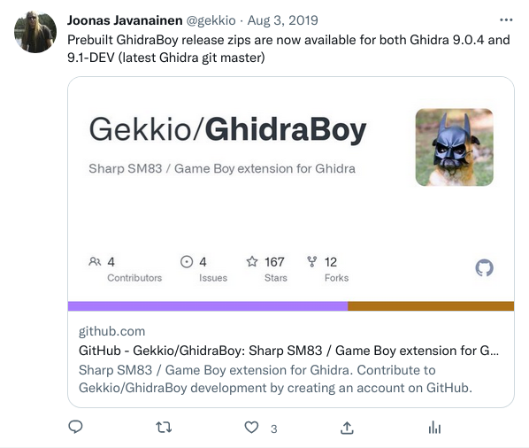](https://twitter.com/gekkio/status/1157408978382610438)

> Prebuilt GhidraBoy release zips are now available for both Ghidra 9.0.4 and 9.1-DEV (latest Ghidra git master) <https://github.com/Gekkio/GhidraBoy>

### 2019-10-21

> I've been working tirelessly to go through and fully understand the recently released amazing Game Boy schematics by @Furrtek. Still got plenty of work, but here's simulation results of some bus accesses that match real hardware. Automatic VHDL generation from KiCad helps 😀 
> [Attached screenshot](1186380074280468480-EHbeY3JWkAEEs4G.png)

Furrtek's release was groundbreaking! I was slightly annoyed about how much time I had personally spent on DMG-CPU B SoC tracing that was now unnecessary, but having full schematics meant a chance to make great progress with improving low-level understanding of the SoC. The only problem was that Furrtek's schematics didn't include the CPU core, and there were quite a lot of mistakes. I couldn't get even the first page to simulate correctly, so I ended up redoing a lot of the work and making my own schematics.

### 2019-11-04

> I've released GhidraBoy 20191104, which has been tested to work with the recently released Ghidra 9.1 release
>
> <https://github.com/Gekkio/GhidraBoy/releases/tag/20191104_ghidra_9.1>

### 2019-11-21

> It's just Tetris, right?
>
> ...this image was generated by a low-level 11kloc VHDL simulation model consisting of 1200+ DMG-CPU B standard cells almost entirely generated from KiCad schematics.
>
> Simulating ~20ms took ~40s of real time and generated a 250MB signal dump file. 
> [Attached screenshot](1197273506423197697-EJ2R5_-W4AAYyqQ.png)

Just one month later after acknowledging Furrtek's amazing work, I had my own WIP schematics simulating Tetris correctly. Unfortunately my approach was getting more and more complicated and error-prone, and this would end up being the best I could do for a while.

## 2020: SM83 CPU decap photo tracing, various GB schematics, work on better decapping microscope {#2020}

### 2020-02-07

> SM83 CPU core tracing progress...unfortunately currently available decap photos are not good enough for much more. But I'm surprised how much one can learn from just looking at how things are connected. For example, the register file has more buses than one might expect. 
> [Attached screenshot](1225901940904808449-EQNC7iNX0AAbkAh.jpg)

After getting frustrated with the inability to run test ROMs on the DMG-CPU B HDL model, I decided to try to reverse engineer the CPU core.

### 2020-02-19

[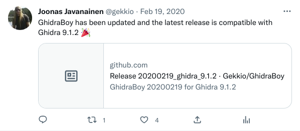](https://twitter.com/gekkio/status/1230202377229209601)

> GhidraBoy has been updated and the latest release is compatible with Ghidra 9.1.2 🎉
>
> <https://github.com/Gekkio/GhidraBoy/releases/tag/20200219_ghidra_9.1.2>

### 2020-03-15

[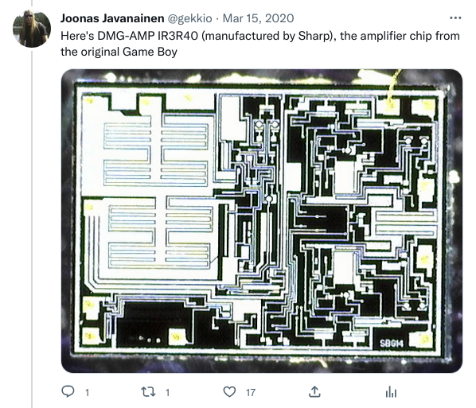](https://twitter.com/gekkio/status/1239214486424301570)

> Here's DMG-AMP IR3R40 (manufactured by Sharp), the amplifier chip from the original Game Boy 
> [Attached photo](1239214486424301570-ETKSxeBWkAISzFo.jpg)

[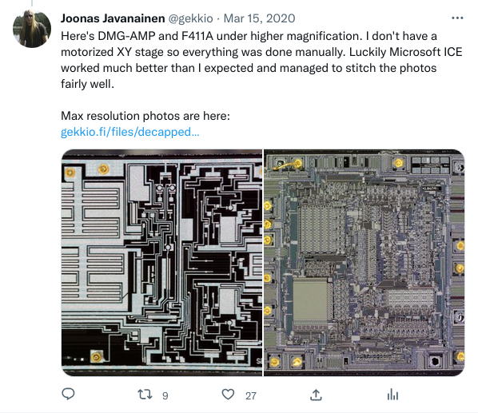](https://twitter.com/gekkio/status/1239280360124567554)

> Here's DMG-AMP and F411A under higher magnification. I don't have a motorized XY stage so everything was done manually. Luckily Microsoft ICE worked much better than I expected and managed to stitch the photos fairly well. 
> [Attached photo](1239280360124567554-ETLLJ_SXkAAYh0h.jpg)
>
> Max resolution photos are here: 
> <https://gekkio.fi/files/decapped-chips/AM4515ZT4/>

### 2020-03-28

[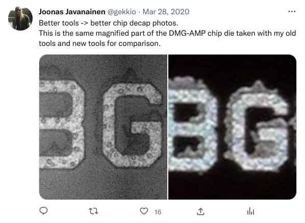](https://twitter.com/gekkio/status/1243887873683869696)

> Better tools -> better chip decap photos. 
> This is the same magnified part of the DMG-AMP chip die taken with my old tools and new tools for comparison. 
> [Attached photo 1](1243887873683869696-EUMsrQhXkAAgXsH.jpg) 
> [Attached photo 2](1243887873683869696-EUMsrQoX0AIbXJm.jpg)

I finally had decent tooling for decapping, although without a motorized stage I was limited to small chips or small areas of large chips...certainly usable for the SM83 CPU core!

### 2020-05-07

> This cell is my reverse engineering mystery of today...behaviour suggests it could be AND gate. But note how In2 only goes to a gnd-side NMOS, so the input side looks almost like Pseudo-NMOS NAND with 2x NMOS in series. But In1 also has the complementary PMOS near vdd-side (?!) 
> [Attached photo](1258483113023373318-EXcGBd0X0AQ4RIO.png)

> Here's how I see it at the moment...black rectangles are the transistors. Seems like an AND gate but In2 PMOS is missing. The yellow signal also has one unexplained via that seems to be connected to diffusion area going up towards gnd, but obscured by the green signal metal 
> [Attached photo](1258498108297752581-EXcUeb4WsAAE_oE.png)

### 2020-05-09

[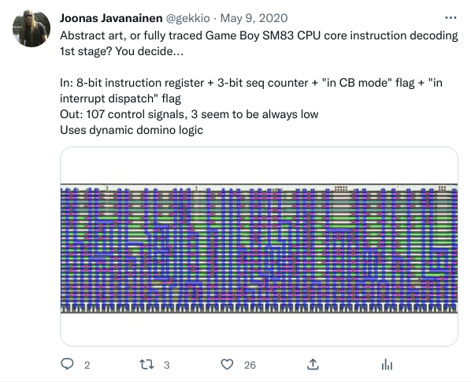](https://twitter.com/gekkio/status/1259135507214327808)

> Abstract art, or fully traced Game Boy SM83 CPU core instruction decoding 1st stage? You decide...
>
> In: 8-bit instruction register + 3-bit seq counter + "in CB mode" flag + "in interrupt dispatch" flag 
> Out: 107 control signals, 3 seem to be always low 
> Uses dynamic domino logic [Attached photo](1259135507214327808-EXlWaWdXgAInMny.jpg)

### 2020-05-27

[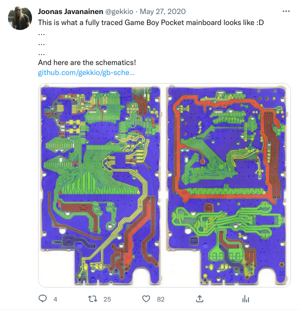](https://twitter.com/gekkio/status/1265706867352797185)

> This is what a fully traced Game Boy Pocket mainboard looks like :D 
> ... 
> ... 
> ... 
> And here are the schematics! 
> <https://github.com/gekkio/gb-schematics> 
> [Attached photo](1265706867352797185-EZCw3tNXkAcUUgZ.jpg)

My first GB schematics release! A lot of work, but I really enjoyed it and ended up reverse engineering much more GB hardware and releasing more schematics.

### 2020-06-14

> GB SM83 CPU core I/O cell reverse engineered. One surprise about the CPU core is how much dynamic logic and precharging it uses. Even the main SoC data bus (EXT_DATA) has precharge circuitry and the CPU core only uses a low-side driver (but SoC peripherals are proper push/pull) 
> [Attached screenshot](1272167835876446210-EaejU6wXQAIIC9m.jpg)

> Some more info and the Inkscape SVG is now here: <https://github.com/Gekkio/sm83-research>
>
> I've got a lot more details about SM83 coming soon™, including new info about the register file and the various (and plentiful) 8-bit buses internal to the CPU core. 
> Also: simulation-tested HDL code

Much later in 2022 when finishing my full RE work on the SM83 CPU core, I was very surprised that I got all the important details right at this point! The locations of individual transistors were sometimes guesses and were not perfectly correct, but I didn't miss any transistors or misunderstand the behaviour.

### 2020-06-19

[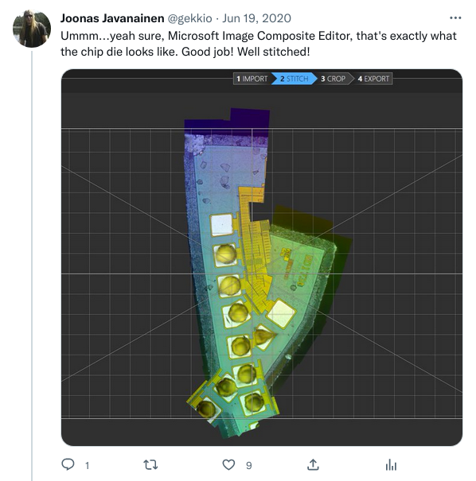](https://twitter.com/gekkio/status/1273971586937360384)

> Ummm...yeah sure, Microsoft Image Composite Editor, that's exactly what the chip die looks like. Good job! Well stitched! 
> [Attached screenshot](1273971586937360384-Ea4NdXIXsAIbjio.jpg)

[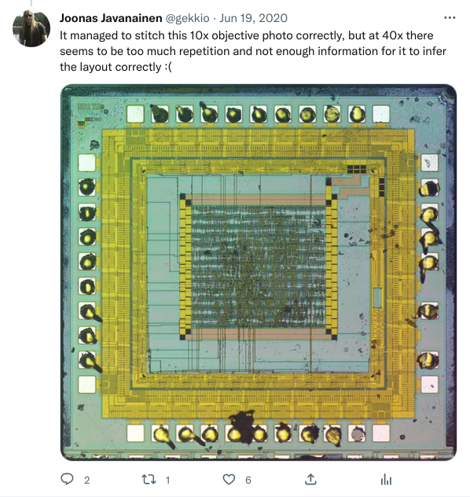](https://twitter.com/gekkio/status/1273972804216664064)

> It managed to stitch this 10x objective photo correctly, but at 40x there seems to be too much repetition and not enough information for it to infer the layout correctly :( 
> [Attached screenshot](1273972804216664064-Ea4O94lX0AECQfy.jpg)

### 2020-06-20

[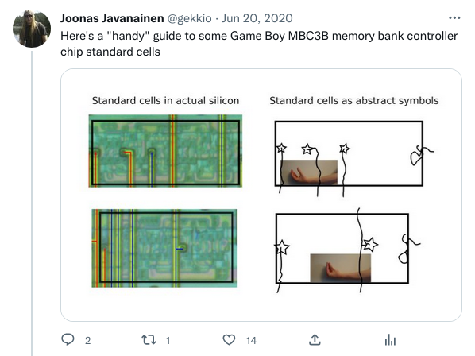](https://twitter.com/gekkio/status/1274427461225402368)

> Here's a "handy" guide to some Game Boy MBC3B memory bank controller chip standard cells 
> [Attached screenshot](1274427461225402368-Ea-s3ijWAActLgL.jpg)

> And no, there's no ARM microcontroller on the chip

Sadly I don't think many people understood this pun... 😭

### 2020-06-29

[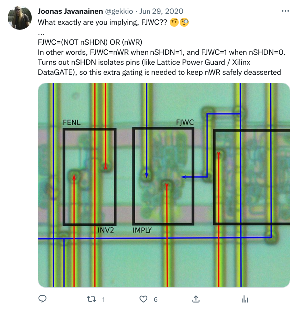](https://twitter.com/gekkio/status/1277675285069148160)

> What exactly are you implying, FJWC?? 🤨🧐 
> ... 
> FJWC=(NOT nSHDN) OR (nWR) 
> In other words, FJWC=nWR when nSHDN=1, and FJWC=1 when nSHDN=0. Turns out nSHDN isolates pins (like Lattice Power Guard / Xilinx DataGATE), so this extra gating is needed to keep nWR safely deasserted 
> [Attached screenshot](1277675285069148160-Ebszbo1WkAMGRnB.jpg)

### 2020-07-22

> Aaaaand nope, I don't think I'll capture a full set of photos of a decapped CPU CGB B chip die, since stitching is a nightmare as usual and I'll go mad before getting it to work with a chip this large. People with motorized XY(Z) stages don't know how lucky they are 
> [Attached screenshot 1](1285952815362383873-EdiekklWsAETEJ4.jpg) 
> [Attached screenshot 2](1285952815362383873-EdielU_WsAA15B9.jpg)

### 2020-08-06

> Decapped an SGB-CPU 01 chip to capture some Game Boy SM83 CPU core photos with 40x magnification + EDF. Can *you* tell the difference between left (from [siliconpr0n.org](https://siliconpr0n.org), 20x I think?) and right (mine, 40x + EDF)? 😎 
> [Attached screenshot](1291426842038153216-EewRFf-WoAAeAx-.png)

[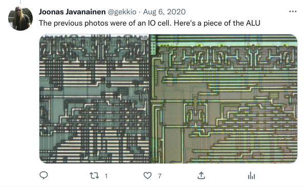](https://twitter.com/gekkio/status/1291429988323950597)

> The previous photos were of an IO cell. Here's a piece of the ALU 
> [Attached screenshot](1291429988323950597-EewUi5xXoAAs4Nf.png)

### 2020-08-09

[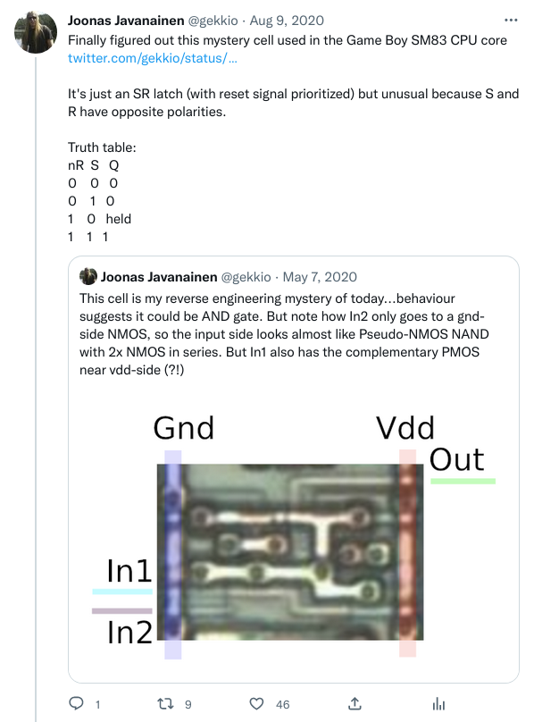](https://twitter.com/gekkio/status/1292206670710480896)

> Finally figured out this mystery cell used in the Game Boy SM83 CPU core [link to tweet](#tweet-1258483113023373318)
>
> It's just an SR latch (with reset signal prioritized) but unusual because S and R have opposite polarities.
>
> Truth table: 
> nR  S   Q 
> 0    0   0 
> 0    1   0 
> 1    0   held 
> 1    1   1 

[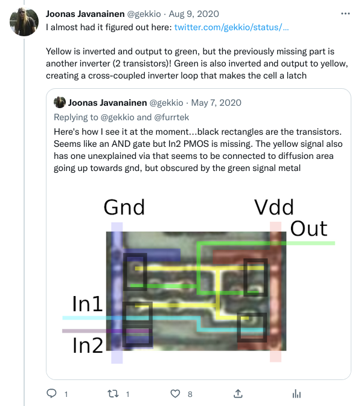](https://twitter.com/gekkio/status/1292211341000876032)

> I almost had it figured out here: [link to tweet](#tweet-1258498108297752581)
>
> Yellow is inverted and output to green, but the previously missing part is another inverter (2 transistors)! Green is also inverted and output to yellow, creating a cross-coupled inverter loop that makes the cell a latch

> Here's a higher resolution photo of the damn thing...
>
> "bastard_gate.jpg" 
> [Attached photo](1292212531340214280-Ee7b9nIXkAcIxDi.jpg)

### 2020-08-22

> Here's something I started writing 4 years ago...I wrote it because most reviews of Game Boy mods/parts focus on ease of installation and not on the technical side
>
> "HHL Bivert Module V2 - technical review" a.k.a "how hard can it be to invert two signals" 
> [link](@/blog/2020/hhl-bivert-v2-technical-review/index.md)

### 2020-10-16

> After another evening of lovely reverse engineering work, I proudly present the first publicly available schematics of Game Boy Advance SP console.
>
> (this is for AGS-001 mainboard revision AGS-CPU-11...other versions have some differences)
>
> <https://github.com/Gekkio/gb-schematics#game-boy-advance-sp-ags-001-mainboard-ags-cpu-11> 
> [Attached screenshot](1317205752608624641-EkencqXXIAEDrM_.jpg)

### 2020-11-13

[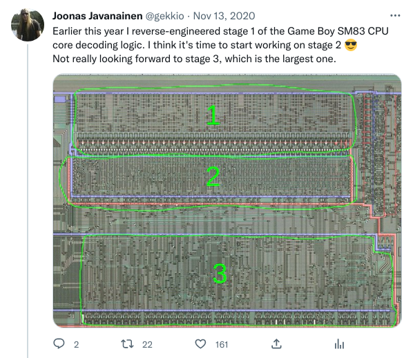](https://twitter.com/gekkio/status/1327011528084774912)

> Earlier this year I reverse-engineered stage 1 of the Game Boy SM83 CPU core decoding logic. I think it's time to start working on stage 2 😎 
> Not really looking forward to stage 3, which is the largest one. 
> [Attached screenshot](1327011528084774912-Emp7CqDXEAI3ust.jpg)

[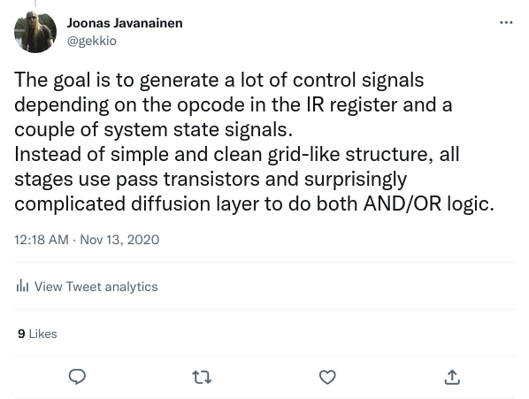](https://twitter.com/gekkio/status/1327012903858434048)

> The goal is to generate a lot of control signals depending on the opcode in the IR register and a couple of system state signals. 
> Instead of simple and clean grid-like structure, all stages use pass transistors and surprisingly complicated diffusion layer to do both AND/OR logic.

[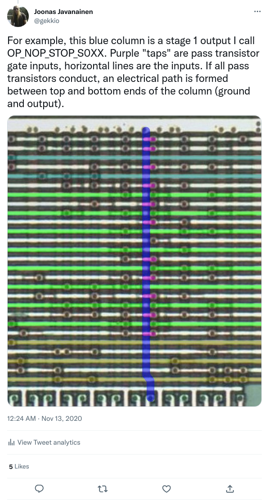](https://twitter.com/gekkio/status/1327014498725748738)

> For example, this blue column is a stage 1 output I call OP_NOP_STOP_S0XX. Purple "taps" are pass transistor gate inputs, horizontal lines are the inputs. If all pass transistors conduct, an electrical path is formed between top and bottom ends of the column (ground and output). 
> [Attached screenshot](1327014498725748738-Emp_YkmXcAAk-lA.jpg)

> Dynamic logic is used, so in one clock phase, the ground in the top end is always disconnected and the output is precharged to 1. In the other clock phase, the ground is available and the column may pull its output low.
>
> Here's a VHDL implementation of this column. 
> [Attached screenshot](1327015222532517888-EmqAwUyWEAEvVlg.jpg)

[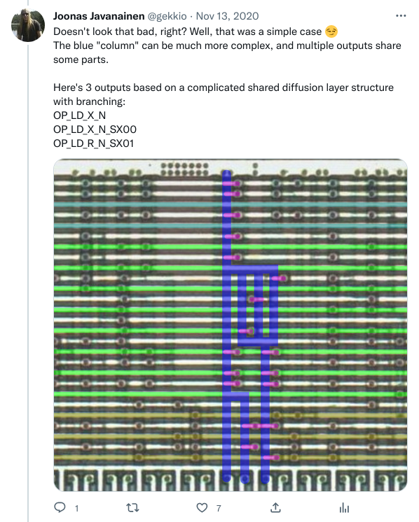](https://twitter.com/gekkio/status/1327016906382045187)

> Doesn't look that bad, right? Well, that was a simple case 😏 
> The blue "column" can be much more complex, and multiple outputs share some parts.
>
> Here's 3 outputs based on a complicated shared diffusion layer structure with branching: 
> OP_LD_X_N 
> OP_LD_X_N_SX00 
> OP_LD_R_N_SX01 
> [Attached screenshot](1327016906382045187-EmqCFxOXcAEY71m.png)

> Remember, all that matters is creating a path to ground! So the three parallel mini columns basically form a NOR3. 
> Here's the VHDL 😅 
> Note that this code intentionally matches the original structure, and the same logic could be written in a simpler way without branching/sharing.  
> [Attached screenshot](1327018976937906176-EmqDWL0XcAYX4E8.jpg)

> Ghidra 9.2 has finally been released and I've also released a new version of GhidraBoy freshly built for Ghidra 9.2 🎉
>
> <https://github.com/Gekkio/GhidraBoy/releases/tag/20201113_ghidra_9.2>

### 2020-11-17

> Took me more than 30 minutes to spot one error in the traced blue areas in Game Boy SM83 CPU core stage 1 decoder. Can *you* spot the mistake?😏
>
> One challenge with stage 2 RE is that even small mistakes in stage 1 propagate and lead to great chaos and confusion in stage 2 
> [Attached screenshot](1328787565143592966-EnDKXZNUwAATnNe.jpg)

### 2020-11-19

[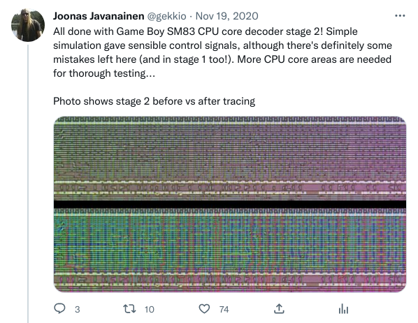](https://twitter.com/gekkio/status/1329188003483430913)

> All done with Game Boy SM83 CPU core decoder stage 2! Simple simulation gave sensible control signals, although there's definitely some mistakes left here (and in stage 1 too!). More CPU core areas are needed for thorough testing...
>
> Photo shows stage 2 before vs after tracing 
> [Attached screenhot](1329188003483430913-EnI4XsbXEAUSR1Q.jpg)

> I've published the Inkscape SVG here:
>
> <https://github.com/Gekkio/sm83-research>
>
> Note that the signal names are still based on "educated guesswork" and might be incorrect and/or misleading.
>
> ...and yes, I know stage 1 is still missing from the repository 😅

### 2020-12-10

> Game Boy SM83 CPU core RE status: since finishing decoder stage 2 and tracing its outputs, I've noticed how we've got a "everything is connected to everything" -type of situation... 
> So now I'm doing the ALU, the register file, and decoder stage 3 at the same time. 😅

> Back when I started this RE work, I imagined a decoder connected like this: 
> opcode + CPU state -> stage1 -> stage2 -> stage3 -> various places like ALU and reg file
>
> Reality: 
> stage1 -> stage2 -> stage3 -> places 
> stage1 -> places 
> stage2 -> places 
> ALU has extra local decoding logic

## 2021 SM83 CPU work burnout, focus on better microscope and random GB projects {#2021}

### 2021-03-09

> It's interesting to watch the value of my stock market investments go down, and the value of the 60+ Game Boys I bought 4-7 years ago to go up 😅 
> Maybe one day I'll actually sell some on Ebay for profit

### 2021-04-05

> Writing a blog post about Game Boy flash cartridge power consumption. Pretty interesting measurement results!
>
> It makes me wonder how optimized existing designs are, and what are the practical limitations in designing low power carts...
>
> Blog post will be available soon™ 
> [Attached screenshot](1379158254400471042-EyO_upCWQAMa88A.jpg)

### 2021-04-16

[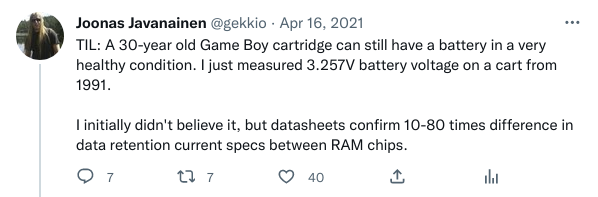](https://twitter.com/gekkio/status/1383148933678006272)

> TIL: A 30-year old Game Boy cartridge can still have a battery in a very healthy condition. I just measured 3.257V battery voltage on a cart from 1991.
>
> I initially didn't believe it, but datasheets confirm 10-80 times difference in data retention current specs between RAM chips.

[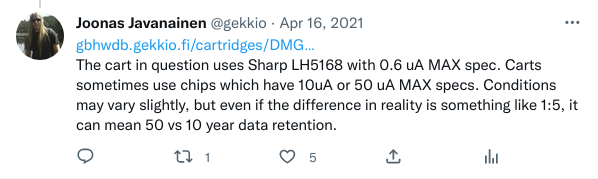](https://twitter.com/gekkio/status/1383150970050338820)

> <https://gbhwdb.gekkio.fi/cartridges/DMG-GWJ-0/gekkio-1.html>
> The cart in question uses Sharp LH5168 with 0.6 uA MAX spec. Carts sometimes use chips which have 10uA or 50 uA MAX specs. Conditions may vary slightly, but even if the difference in reality is something like 1:5, it can mean 50 vs 10 year data retention.

### 2021-04-17

> New blog post: Power Consumption of Game Boy Flash Cartridges
>
> [link](@/blog/2021/power-consumption-of-game-boy-flash-cartridges/index.md)
>
> Short summary: 
> Everdrive GB X5 beats other SD-card flash cartridges. Genuine carts beat Everdrive GB X5. My designs usually beat genuine carts

### 2021-05-08

[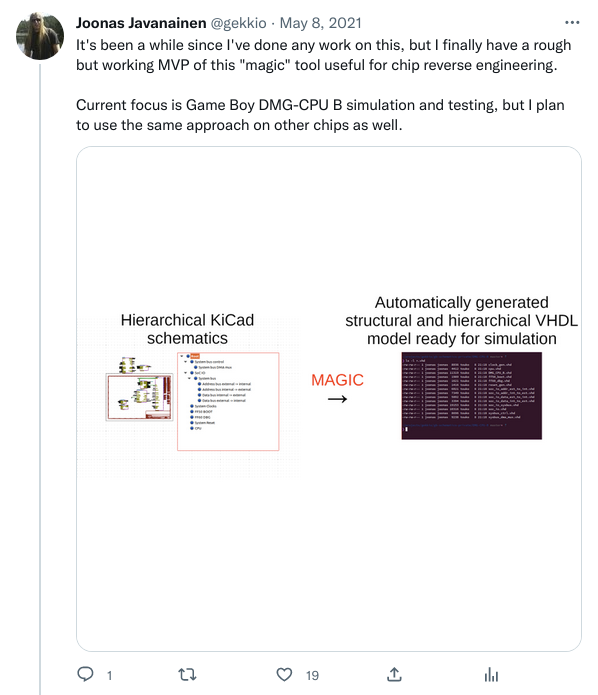](https://twitter.com/gekkio/status/1391098901059579905)

> It's been a while since I've done any work on this, but I finally have a rough but working MVP of this "magic" tool useful for chip reverse engineering.
>
> Current focus is Game Boy DMG-CPU B simulation and testing, but I plan to use the same approach on other chips as well. 
> [Attached screenshot](1391098901059579905-E04rPrcWUAA97kk.png)

[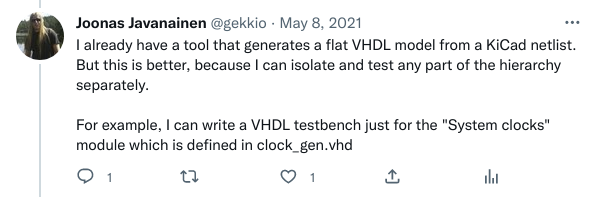](https://twitter.com/gekkio/status/1391101118474764288)

> I already have a tool that generates a flat VHDL model from a KiCad netlist. But this is better, because I can isolate and test any part of the hierarchy separately.
>
> For example, I can write a VHDL testbench just for the "System clocks" module which is defined in clock_gen.vhd

> And it turns out testing is crucial when dealing with a model of a large chip. 
> Maybe some cell has been misidentified or signal polarity is wrong in some cell model. A simple mistake can ruin the entire model, so I find testing and building trust piece by piece very important

### 2021-05-29

> GhidraBoy for Ghidra 9.2.4 has been released 🎉
>
> Developing new GhidraBoy features is not on top of my list at the moment, but I *do* try to keep up with Ghidra releases so you should never find yourself unable to upgrade Ghidra just because GhidraBoy is holding you back.

### 2021-06-30

[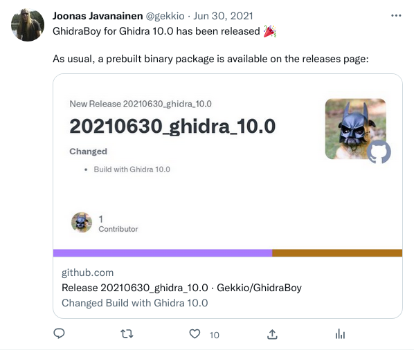](https://twitter.com/gekkio/status/1410264175599931396)

> GhidraBoy for Ghidra 10.0 has been released 🎉
>
> As usual, a prebuilt binary package is available on the releases page:
>
> <https://github.com/Gekkio/GhidraBoy/releases/tag/20210630_ghidra_10.0>

### 2021-07-07

[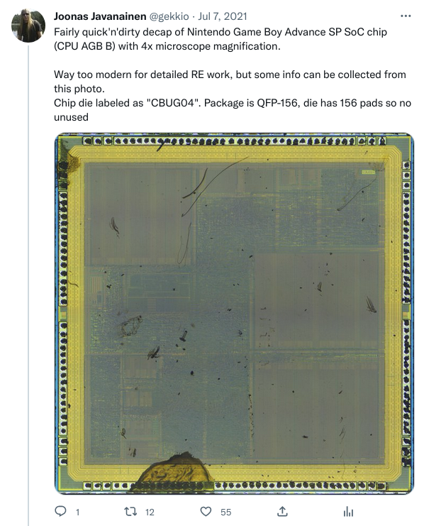](https://twitter.com/gekkio/status/1412814144349347847)

> Fairly quick'n'dirty decap of Nintendo Game Boy Advance SP SoC chip (CPU AGB B) with 4x microscope magnification.
>
> Way too modern for detailed RE work, but some info can be collected from this photo. 
> Chip die labeled as "CBUG04". Package is QFP-156, die has 156 pads so no unused 
> [Attached photo](1412814144349347847-E5tRVpvWEAMOzQm.jpg)

> Max quality stitched photo is available here:
>
> <https://gekkio.fi/files/decapped>

### 2021-09-01

> I've released the schematic for the original Game Boy LCD board (version DMG-LCD-06)
>
> Not terribly exciting, but these are (hopefully) accurate unlike the older schematics you can find online.
>
> <https://github.com/Gekkio/gb-schematics#original-game-boy-lcd-board-dmg-lcd-06>

### 2021-10-31

[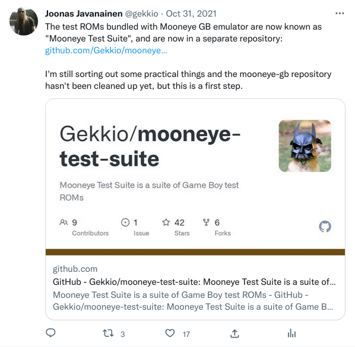](https://twitter.com/gekkio/status/1454910696454598656)

> The test ROMs bundled with Mooneye GB emulator are now known as "Mooneye Test Suite", and are now in a separate repository:
> <https://github.com/Gekkio/mooneye-test-suite/>
>
> I'm still sorting out some practical things and the mooneye-gb repository hasn't been cleaned up yet, but this is a first step.

### 2021-12-11

> GhidraBoy for Ghidra 10.1 has been released, so you no longer need to fear Java logging library CVEs when doing Game Boy ROM reverse engineering :)
>
> <https://github.com/Gekkio/GhidraBoy/releases/tag/20211211_ghidra_10.1>

## 2022: More schematics, SM83 CPU core fully reverse engineered {#2022}

### 2022-01-02

[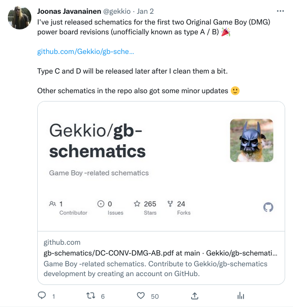](https://twitter.com/gekkio/status/1477635068814401540)

> I've just released schematics for the first two Original Game Boy (DMG) power board revisions (unofficially known as type A / B) 🎉
>
> <https://github.com/Gekkio/gb-schematics/blob/main/DC-CONV-DMG-AB/schematic/DC-CONV-DMG-AB.pdf>
>
> Type C and D will be released later after I clean them a bit.
>
> Other schematics in the repo also got some minor updates 🙂

### 2022-01-12

[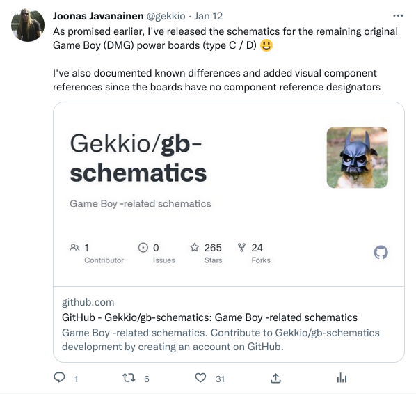](https://twitter.com/gekkio/status/1481381078631956483)

> As promised earlier, I've released the schematics for the remaining original Game Boy (DMG) power boards (type C / D) 😃
>
> I've also documented known differences and added visual component references since the boards have no component reference designators
>
> <https://github.com/Gekkio/gb-schematics#original-game-boy-dcdc-power-board-dc-conv-dmg--dc-conv2-dmg>

### 2022-02-19

> 🎶 
> Might as well jump 
> Go ahead and jump 
> Get it in, jump 
> Go ahead and jump 
> 🎶
>
> For some strange reason I sometimes think about this song whenever I install more than 1 of these things... 
> [Attached photo 1](1494796818298855425-FL6T0KFXMAEsbKW.jpg) 
> [Attached photo 2](1494796818298855425-FL6T2ilWUAUanmh.jpg)

This lovely board would eventually make it much easier to capture all cartridge bus signals with a logic analyzer...at the time of writing (2022), it's not open source but perhaps I'll release it at some point.

> Here's a sneak peek of my next Game Boy schematics project. I've already desoldered and characterized all components and am now doing tracing. After that it's time for schematics...
>
> This time the trace SVG is also nicer since I have two separate but aligned BG layers 
> [Attached screenshot](1494799536321179655-FL6XyVRX0AELY2W.jpg)

### 2022-03-09

> My current chip decap project: Game Boy MBC1B memory bank controller chip found on many cartridges. This chip is already well understood, but decided to RE it thoroughly anyway.
>
> I've already traced everything and just need to finish the schematics... 
> [Attached screenshot 1](1501611657537241092-FNbKMpYWYAI_cqo.jpg) 
> [Attached screenshot 2](1501611657537241092-FNbLmVqXMAAPIej.jpg)

> Image quality is pretty bad since I used a low-quality 20x objective 😅 lots of optical aberrations...
>
> It's good enough to identify cells and connections, but I took some extra photos with a good 40x objective to study internal cell structures.
>
> Just look at the difference 😻 
> [Attached screenshot](1501614894633959426-FNbN299XsAAwFNp.jpg)

[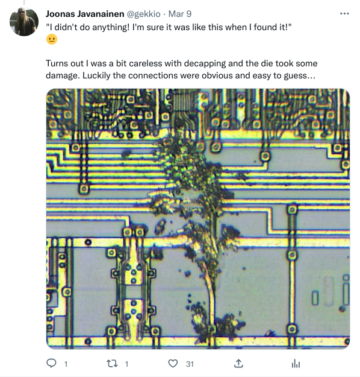](https://twitter.com/gekkio/status/1501616502352580614)

> "I didn't do anything! I'm sure it was like this when I found it!" 
> 😐
>
> Turns out I was a bit careless with decapping and the die took some damage. Luckily the connections were obvious and easy to guess... 
> [Attached screenshot](1501616502352580614-FNbPCMtXoAcjnWa.jpg)

### 2022-03-13

> I've just released my Game Boy MBC1B chip research 🎉
>
> <https://github.com/Gekkio/gb-research/tree/main/mbc1b>
>
> - fully traced SVG file based on decapped chip photo 
> - KiCad schematics 
> - automatically generated VHDL model 
> - VHDL testbench, also verified on real HW
>
> Let's take a look at what's in the repo 🧵

This was an important "practice project", because I was going to use the same techniques for the SM83 CPU core and the full SoC.

> Firstly we have the SVG file using a decapped die photo as a background.
>
> All connections are traced and cells are identified. I've even added start/end markers to connections: for example, "FE" OAI21 cell has one output (top left) and three inputs (2x top right, and 1x bottom) 
> [Attached screenshot](1502987966892974081-FNuvAtdXoAAi1Du.jpg)

> Then we have the KiCad schematics (top level sheet in the screenshot). I've tried to make them as readable as possible, but this is still a 1:1 cell-level mapping to the SVG so nothing should be missing. 
> [Attached screenshot](1502988513914068999-FNuvtPqXsAE5ALj.png)

[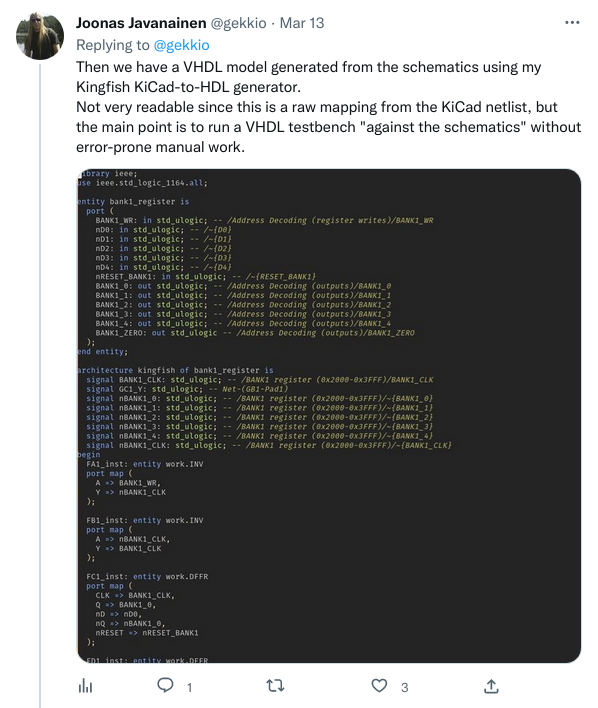](https://twitter.com/gekkio/status/1502989656224419843)

> Then we have a VHDL model generated from the schematics using my Kingfish KiCad-to-HDL generator. 
> Not very readable since this is a raw mapping from the KiCad netlist, but the main point is to run a VHDL testbench "against the schematics" without error-prone manual work. 
> [Attached screenshot](1502989656224419843-FNuwOtYWQAYqR9h.jpg)

> Finally, a VHDL testbench tests and describes the expected behaviour of the generated model. These tests were taken from my old "gpio-bench" hardware system which ran peek/poke -style tests on a real MBC1 chip, so the tests have been previously verified on real hw. 
> [Attached screenshot](1502990663788511239-FNuxVLfXsAQEBat.png)

> Having a way to "test the schematics" has been invaluable...even on a simple chip like this I had one misidentified cell, which was only caught once I started running tests. Staring at schematics and trying to reason about them is way too slow and error-prone for me 😅

### 2022-03-19

> I proudly present the schematics of Game Boy Light (a.k.a MGL) 🎉
>
> <https://github.com/Gekkio/gb-schematics/blob/main/MGL-CPU-01/schematic/MGL-CPU-01.pdf>
>
> As expected, it's 95% identical to Game Boy Pocket (a.k.a MGB), but that 5% includes some important differences that are now documented.
>
> Only *one* MGL was harmed to make these 😅

RIP my only Game Boy Light...it was kind of an expensive sacrifice, but I never used it anyway...🥲

### 2022-05-07

[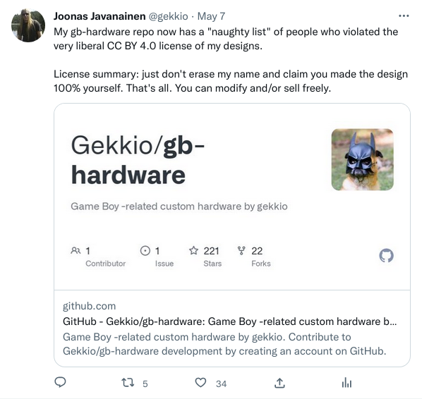](https://twitter.com/gekkio/status/1523011738551164929)

> My gb-hardware repo now has a "naughty list" of people who violated the very liberal CC BY 4.0 license of my designs.
>
> License summary: just don't erase my name and claim you made the design 100% yourself. That's all. You can modify and/or sell freely.
>
> <https://github.com/gekkio/gb-hardware#license-violations-aka-naughty-list>

### 2022-05-30

> Time for another Game Boy -related schematics release: I've RE'd 2 types of Game Boy Pocket DC/DC conversion boards! AFAIK there are no others.
>
> LSEP01088A1 (a.k.a. type A):
>
> <https://github.com/Gekkio/gb-schematics/blob/main/LSEP01088A1/schematic/LSEP01088A1.pdf>
>
> A different one with the text "MGB" (a.k.a. type B):
>
> <https://github.com/Gekkio/gb-schematics/blob/main/MGB-DCDC-B/schematic/MGB-DCDC-B.pdf>

### 2022-09-12

> When I woke up yesterday, I had no idea I'd end up reverse engineering the Game Boy MBC2A mapper chip 😅
>
> Yesterday was spent on tracing, so now I just need to do schematics and simulation.
>
> Original background microscope photo by Raphael Boichot: <https://github.com/Raphael-Boichot/Game-Boy-chips-decapping-project/> 
> [Attached screenshot](1569340023992119298-FcdqX8BWYAE3xD4.jpg)

*Narrator's voice*: "Just schematics and simulation" would end up taking months...

[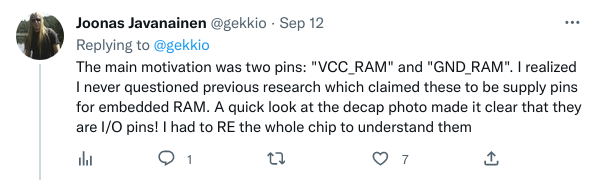](https://twitter.com/gekkio/status/1569426101721612288)

> The main motivation was two pins: "VCC_RAM" and "GND_RAM". I realized I never questioned previous research which claimed these to be supply pins for embedded RAM. A quick look at the decap photo made it clear that they are I/O pins! I had to RE the whole chip to understand them

[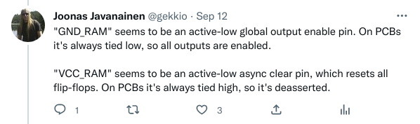](https://twitter.com/gekkio/status/1569427215338577932)

> "GND_RAM" seems to be an active-low global output enable pin. On PCBs it's always tied low, so all outputs are enabled.
>
> "VCC_RAM" seems to be an active-low async clear pin, which resets all flip-flops. On PCBs it's always tied high, so it's deasserted.

[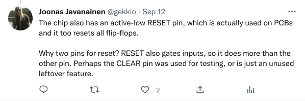](https://twitter.com/gekkio/status/1569427855737487361)

> The chip also has an active-low RESET pin, which is actually used on PCBs and it too resets all flip-flops.
>
> Why two pins for reset? RESET also gates inputs, so it does more than the other pin. Perhaps the CLEAR pin was used for testing, or is just an unused leftover feature.

### 2022-10-16

[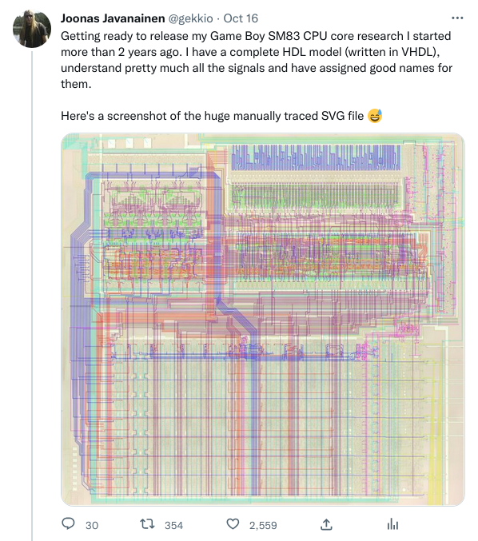](https://twitter.com/gekkio/status/1581674682842955776)

> Getting ready to release my Game Boy SM83 CPU core research I started more than 2 years ago. I have a complete HDL model (written in VHDL), understand pretty much all the signals and have assigned good names for them.
>
> Here's a screenshot of the huge manually traced SVG file 😅 
> [Attached screenshot](1581674682842955776-FfM6_oQXEAU0EVV.jpg)

I was way too excited about this project and ended up tweeting this when I still had more work to do before release...perhaps I should've just tweeted the actual release, which happened just a week later.

> Here's a zoomed in section of the ALU. The background is a massive stitched photo taken with my microscope using a 40x objective. Some educated guesswork based on my understanding of the chip was needed, because I can't see what's under the top metal layer. 
> [Attached screenshot](1581676477984124928-FfM9J6iWQAIzzF-.jpg)

[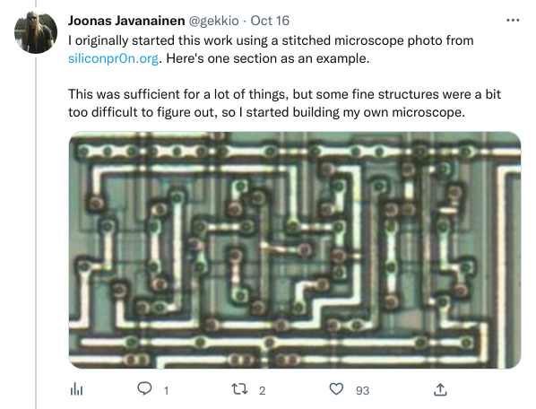](https://twitter.com/gekkio/status/1581686531529457664)

> I originally started this work using a stitched microscope photo from [siliconpr0n.org](https://siliconpr0n.org). Here's one section as an example.
>
> This was sufficient for a lot of things, but some fine structures were a bit too difficult to figure out, so I started building my own microscope. 
> [Attached photo](1581686531529457664-FfNHJI8XgAEcXmt.jpg)

[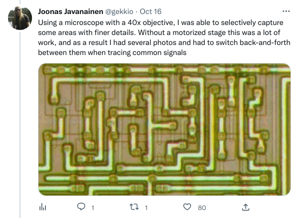](https://twitter.com/gekkio/status/1581688258953547778)

> Using a microscope with a 40x objective, I was able to selectively capture some areas with finer details. Without a motorized stage this was a lot of work, and as a result I had several photos and had to switch back-and-forth between them when tracing common signals 
> [Attached photo](1581688258953547778-FfNHkZ1XkAEIPfQ.jpg)

> The solution: capture the whole CPU core at 40x and make one big photo. This summer after a lot of work, I finally had a motorized scope and was able to do it. I've moved most of my previous work to this new single photo, fixed mistakes, and worked on the last ~10% I was missing 
> [Attached photo](1581689411107897344-FfNJ2zqXkAIMxdx.jpg)

> This turned out to be very useful 😄 As an example, here's one output from decoder stage 1, used by stage 2 and 3 and also the ALU. Previously I had 4 separate SVG files and had to jump between them to understand the whole signal. Now it's enough to look at one trace in one file 
> [Attached photo](1581691747591077888-FfNLmj5XkAIPZzz.jpg)

### 2022-10-23

> After 2+ years of research, it's time to release my Game Boy SM83 CPU core RE work!
>
> <https://github.com/Gekkio/gb-research/tree/main/sm83-cpu-core>
>
> Includes non-synthesizable HDL model and an SVG with almost all important stuff traced.
>
> Passes Blargg's cpu_instrs tests, except "02 interrupts" which needs a full SoC 
> [Attached screenshot](1584234589442441219-FfxTpFrWQAA0xkx.jpg)

This was a massive milestone and the result of a lot of work...I could finally run test ROMs with my DMG-CPU B SoC model and continue that work. Many questions about the SM83 CPU core also got answered.

[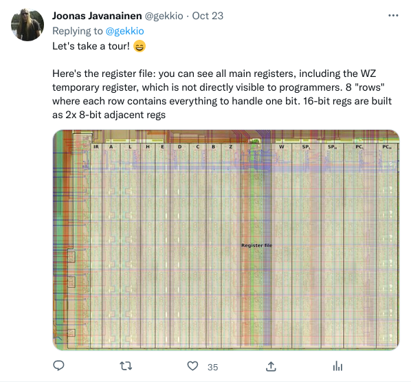](https://twitter.com/gekkio/status/1584236637932126208)

> Let's take a tour! 😄
>
> Here's the register file: you can see all main registers, including the WZ temporary register, which is not directly visible to programmers. 8 "rows" where each row contains everything to handle one bit. 16-bit regs are built as 2x 8-bit adjacent regs 
> [Attached screenshot](1584236637932126208-FfxVt4jXEAEn_YH.jpg)

> Next to the reg file we have the Increment/Decrement Unit (IDU) and some interrupt handling logic. The IDU is a separate unit from ALU, and does 16-bit increment/decrement/load operations, and also outputs the 16-bit address to the rest of the SoC. 
> [Attached screenshot](1584237201411305472-FfxW5Q5XgAE-s90.jpg)

[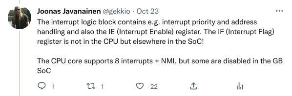](https://twitter.com/gekkio/status/1584238102335610880)

> The interrupt logic block contains e.g. interrupt priority and address handling and also the IE (Interrupt Enable) register. The IF (Interrupt Flag) register is not in the CPU but elsewhere in the SoC!
>
> The CPU core supports 8 interrupts + NMI, but some are disabled in the GB SoC

[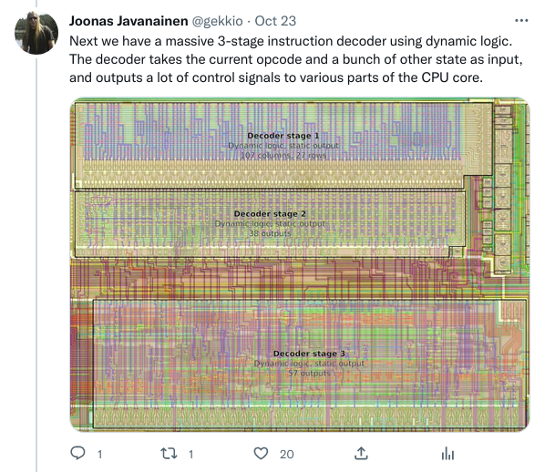](https://twitter.com/gekkio/status/1584238514769575937)

> Next we have a massive 3-stage instruction decoder using dynamic logic. The decoder takes the current opcode and a bunch of other state as input, and outputs a lot of control signals to various parts of the CPU core. 
> [Attached screenshot](1584238514769575937-FfxYQbIXgAAPolR.jpg)

[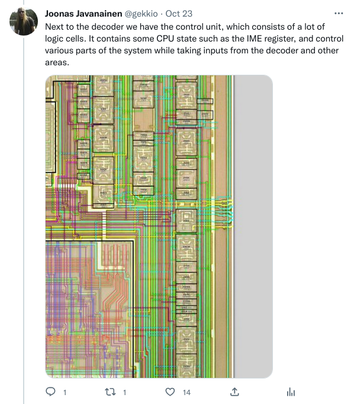](https://twitter.com/gekkio/status/1584239205903142913)

> Next to the decoder we have the control unit, which consists of a lot of logic cells. It contains some CPU state such as the IME register, and control various parts of the system while taking inputs from the decoder and other areas. 
> [Attached screenshot](1584239205903142913-FfxYqV_X0AAmZ7l.jpg)

> A very important part of the system is the 8-bit Arithmetic and Logic Unit (ALU), which handles 8-bit calculations (the IDU does some 16-bit stuff instead). I've also included the flag registers here, but it's debatable whether they are truly part of the ALU or not. 
> [Attached screenshot](1584240032910839808-FfxZR3hWQAA9JVv.jpg)

[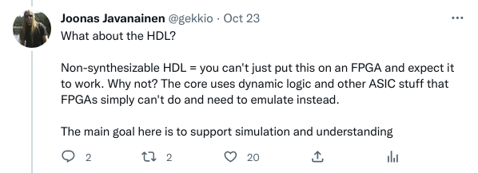](https://twitter.com/gekkio/status/1584241140391239681)

> What about the HDL?
>
> Non-synthesizable HDL = you can't just put this on an FPGA and expect it to work. Why not? The core uses dynamic logic and other ASIC stuff that FPGAs simply can't do and need to emulate instead.
>
> The main goal here is to support simulation and understanding

> What we *can* do is use this HDL as a reference model to build a more FPGA-friendly model. Many things can be simplified and improved, and the result can be compared to the reference.
>
> No plans to do this myself (for now), but I hope the HDL helps other people 😄

[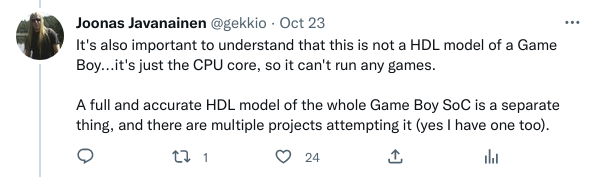](https://twitter.com/gekkio/status/1584246690294693889)

> It's also important to understand that this is not a HDL model of a Game Boy...it's just the CPU core, so it can't run any games.
>
> A full and accurate HDL model of the whole Game Boy SoC is a separate thing, and there are multiple projects attempting it (yes I have one too).

## Final words

What a rollercoaster these 8 years have been! I've never been a huge fan of twitter, but it has been one of the main communication channels where I've announced new info about my various Game Boy projects. In the future, I'll probably focus on Mastodon instead of Twitter, despite having less than 1/10 followers there.
