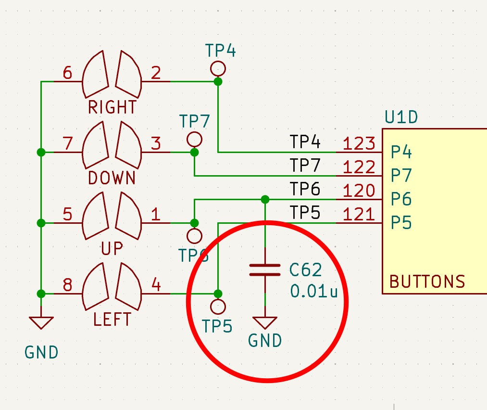
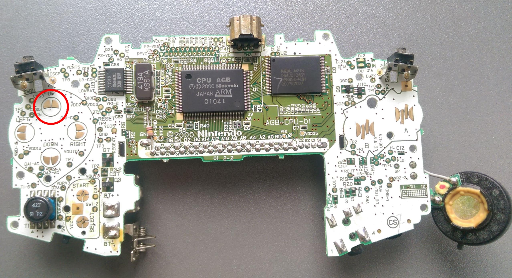
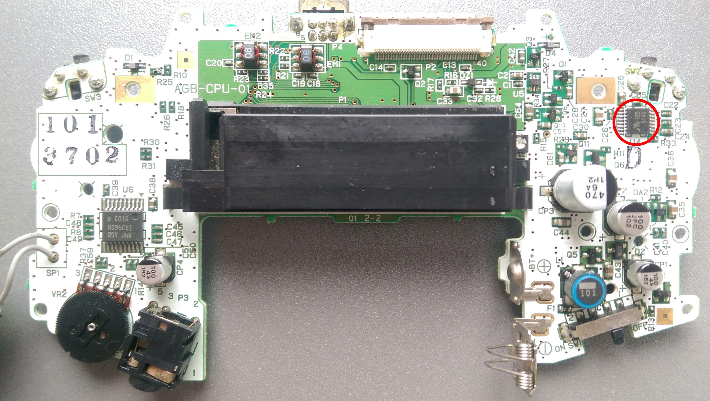
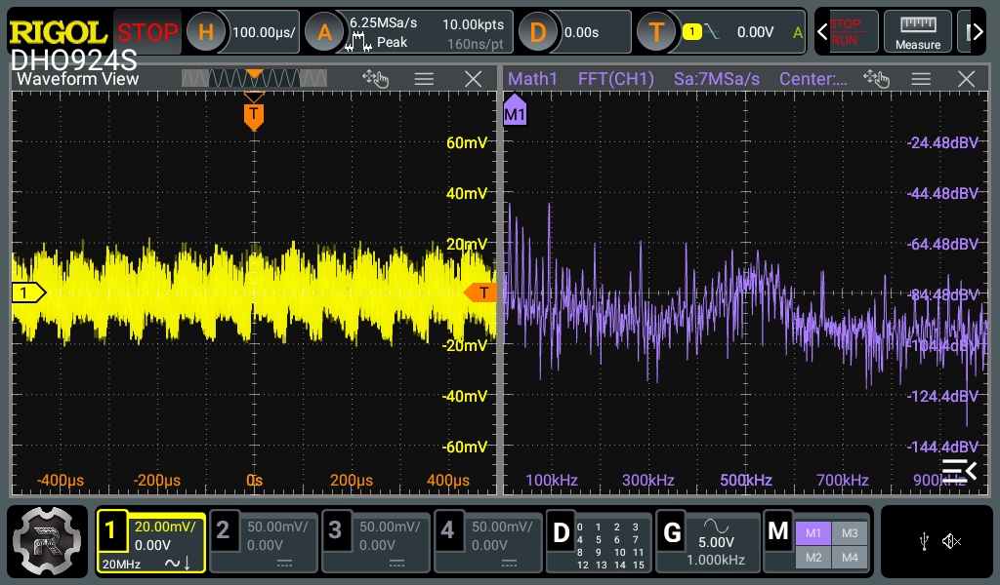
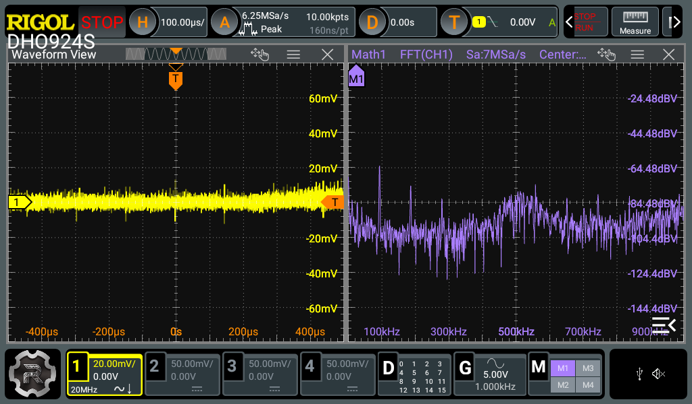

+++
title = "Game Boy Advance d-pad capacitor measurements"
date = 2026-02-07
+++

Game Boy Advance boards have a **10 nF capacitor C62** between the d-pad up input and ground, but other d-pad buttons have no capacitor. This raises the question: why is it needed for one input but not for the others?

<figure>

<figcaption>Schematic screenshot from <a href="https://github.com/Redherring32/OpenTendo-AGB">OpenTendo Game Boy Advance</a>, which is a recreation of the original board</figcaption>
</figure>

## Theory: DC/DC conversion noise

I think the capacitor is needed, because the d-pad is very close to the noisy DC/DC conversion circuitry. Without the capacitor you could get spurious up button presses in some scenarios, which isn't something we want while playing a difficult game on the console. Let's look at the placement of the d-pad:

<figure>

<figcaption>AGB console front photo with up button pads highlighted</figcaption>
</figure>

The d-pad is on the left side of the board. On this side you can see some components of the DC/DC conversion circuitry, such as transformer T1 on the bottom.

<figure>

<figcaption>AGB console back photo with the PMIC highlighted</figcaption>
</figure>

If we flip the PCB to look at the other side, we see a Power Management IC (PMIC) directly behind the up button pads. There are also other DC/DC conversion components, such as capacitors and a boost inductor, around the right side of the PCB. The PMIC is not necessarily the noisiest part of the conversion circuit, but the PCB has no inner layers to shield the two opposing sides from each other, so component locations matter.

## Real-world measurements

The effect of the capacitor can be seen in real-world measurements. Here's the measurement setup:

- a GBA with an AGB-CPU-01 mainboard ([AH10045235](https://gbhwdb.gekkio.fi/consoles/agb/AH10045235.html))
- a programmable DC power supply outputting a stable +3V, connected to the GBA battery connectors
- no game is inserted, and the measurements were started only after the boot animation finished
- Rigol DHO924S oscilloscope using a 10x probe, AC coupling, peak detection mode, 20 MHz bandwidth limit enabled
- oscilloscope probe with ground spring, measuring two pads of a d-pad input (ground spring goes to GND, probe pin goes to the other pad)

First, let's look at a reference measurement from the **left d-pad**:

<figure>

<figcaption>Left d-pad measurement</figcaption>
</figure>

In the screenshot we can see the raw AC-coupled signal on the left side, and a Fast Fourier Transform (FFT) on the right side, showing the frequency spectrum up to 1 MHz. The total peak-to-peak noise is around 40 mV, which is not a lot and the scope's own noise is also probably affecting it. In the FFT we can see a peak at ~95 kHz, which is in this case the DC/DC conversion switching frequency. We can also see harmonics of this switching frequency at integer multiples (190 kHz, 285 kHz, etc...).

Let's also look at the up d-pad:

<figure>

<figcaption>Up d-pad measurement (unmodified console)</figcaption>
</figure>

The up input is a lot less noisy, which is not surprising since capacitor C62 reduces the noise.

However, here's what happens if we **desolder C62**:

<figure>

<figcaption>Up d-pad measurement (C62 desoldered)</figcaption>
</figure>

When there's no C62 capacitor, the up input is *more noisy* than the left input. The total noise is around 60 mV in this case, and the FFT shows even more clearly the switching frequency and its harmonics.

## Conclusions

The measurements clearly show that the up input is more noisy than the left input when C62 is not present. 40 mV vs 60 mV peak-to-peak might not sound like much, but the measurements were done in very "nice" conditions at room temperature, using stable +3V input, and with no game inserted. In real-world use there are many factors that affect the noise, so a good design leaves plenty of safety margin. In this case, Nintendo probably calculated that adding an extra capacitor was worth it, compared to the risk of users having issues with the up button input.

### TL;DR

Due to its location on the board, the up input gets more DC/DC conversion noise than other d-pad inputs. C62 is probably there to reduce noise so there's less risk of spurious up button presses.
